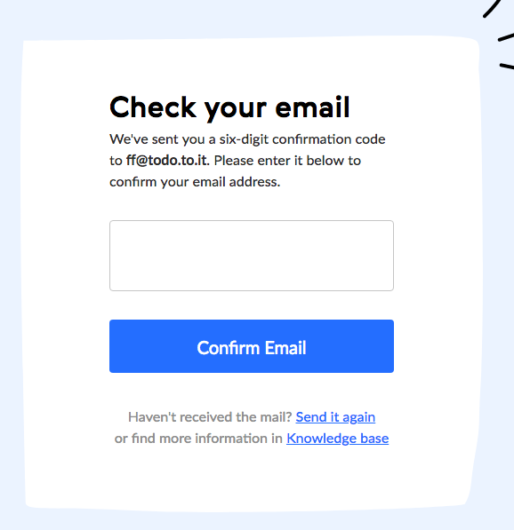

Again from [RealtimeBoard.com](https://realtimeboard.com), a increasing trend these days about the email verification step.

The user is asked to digit manually a given code instead clicking an email link.

From security perspective, no difference at all, therefore, it must be a UX decision. Still not convinced about its usability.