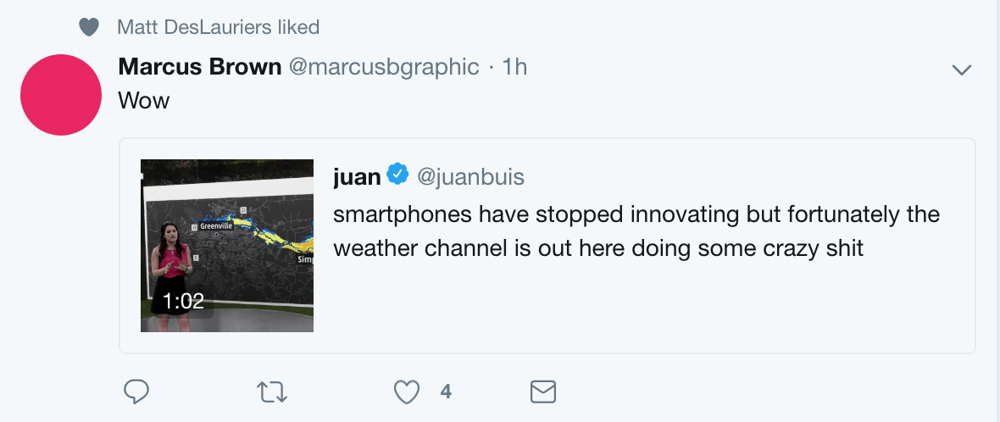

It [spreads](https://www.theverge.com/2018/9/13/17857478/hurricane-florence-storm-surge-flooding-the-weather-channel-video-graphics) [on](https://mashable.com/article/weather-channel-hurricane-florence/?europe=true) internet quite well these days and this is a tweet that sums up well the thing:

A very effective mixed reality visualization of the effects of the storm in Florence, USA.

No other graphical representations are able to provide this kind of sensation.

<iframe width="560" height="315" src="https://www.youtube.com/embed/nTasXwJkPU8" frameborder="0" allow="autoplay; encrypted-media" allowfullscreen></iframe>