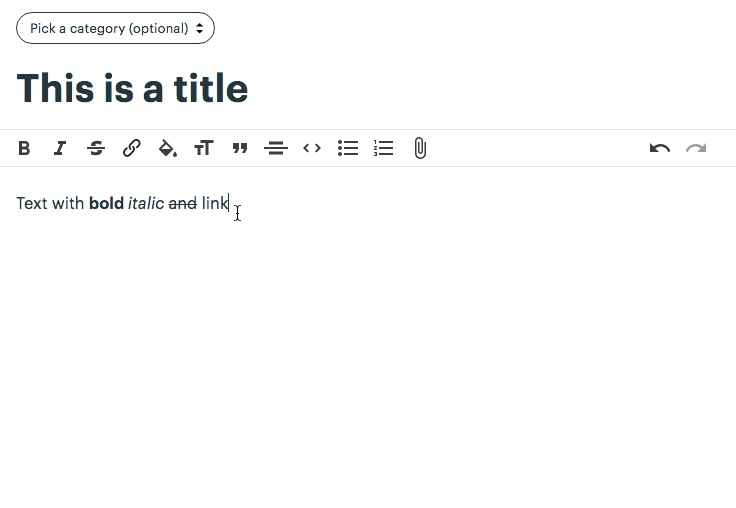

Working on a personal project that involves a lot of interface design makes me very reactive to any good solutions I've encountered around.

This little gem comes from the good guys of Basecamp and their text editor. The URL input component is sleek and efficient for the user:

