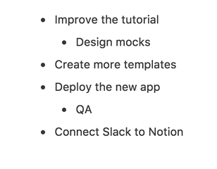
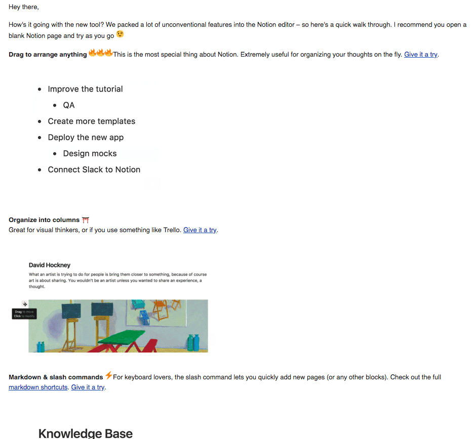

I love the way [Notion](https://www.notion.so/) use the newsletter to update its users as well as trying to engage them with small gif screencast of some features like this one:

It's a very efficient way to give a spark of something new that is also attractive as well, the perfect assist for a call-to-action.

This is a screenshot of the email received for reference:

