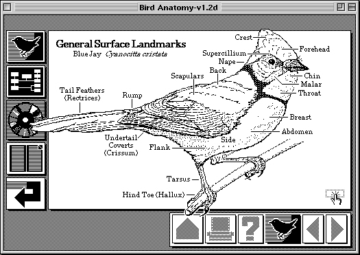

The rise of a new breed of spreadsheets.

It's the sign of the time, the spreadsheet model, as we know today, is definitely going to change, according to the new paradigms we can start to taste.

[Airtable](https://airtable.com) and [Coda](https://coda.io) in one direction, [DropBox Paper](https://paper.dropbox.com) and [Notion](https://www.notion.so) in the other, are the signals of this change.

The ability to store and structure data and information (a database) with the possibility to build and shape user interfaces that are related to that database, everything within an authoring tool, easy to use.

To be fair, this paradigm [exists](https://en.wikipedia.org/wiki/HyperCard) since more than 30 years ago :)

