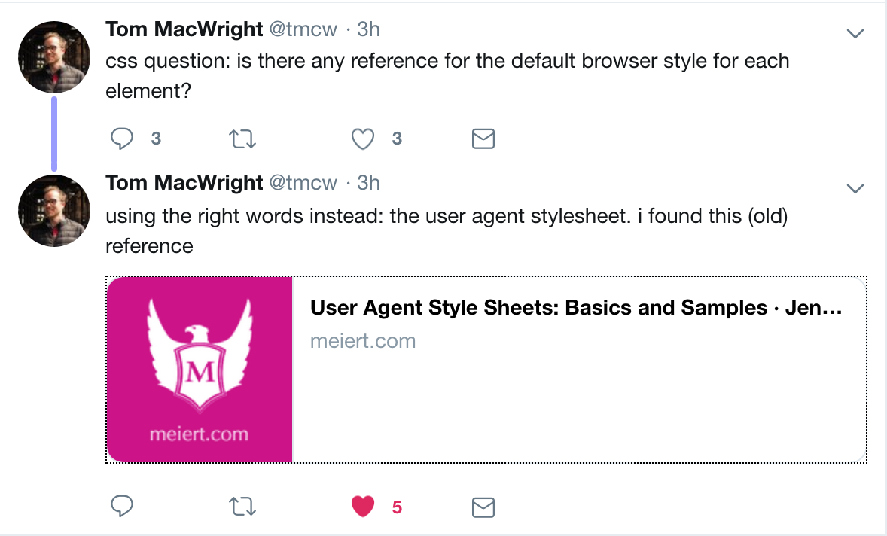

TIL from this tweet:

that there's a [reference](https://meiert.com/en/blog/user-agent-style-sheets/) of the CSS style used by the browsers, technically it's the User-Agent default style.

The default style is used to show web-pages in a resonable way when the styles are missing or disabled.

What I've learned by poking in the [CSS source](https://trac.webkit.org/browser/trunk/Source/WebCore/css/html.css) of Chrome is the `q` HTML tag I didn't know about.

It's used to specifing quotes in text block. The default style automatically adds open and close quotes.

Neat!