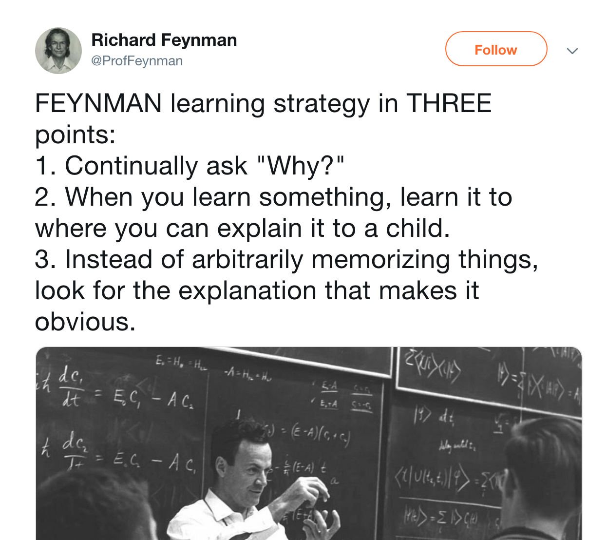

Learning from Feynman

Lovely quote about learning process from the genius Feynman:

1. Continually ask "Why?"
2. When you learn something, learn it to where you can explain it to a child.
3. Instead of arbitrarily memorizing things, look for the explanation that makes it obvious.

Food for thoughts.

