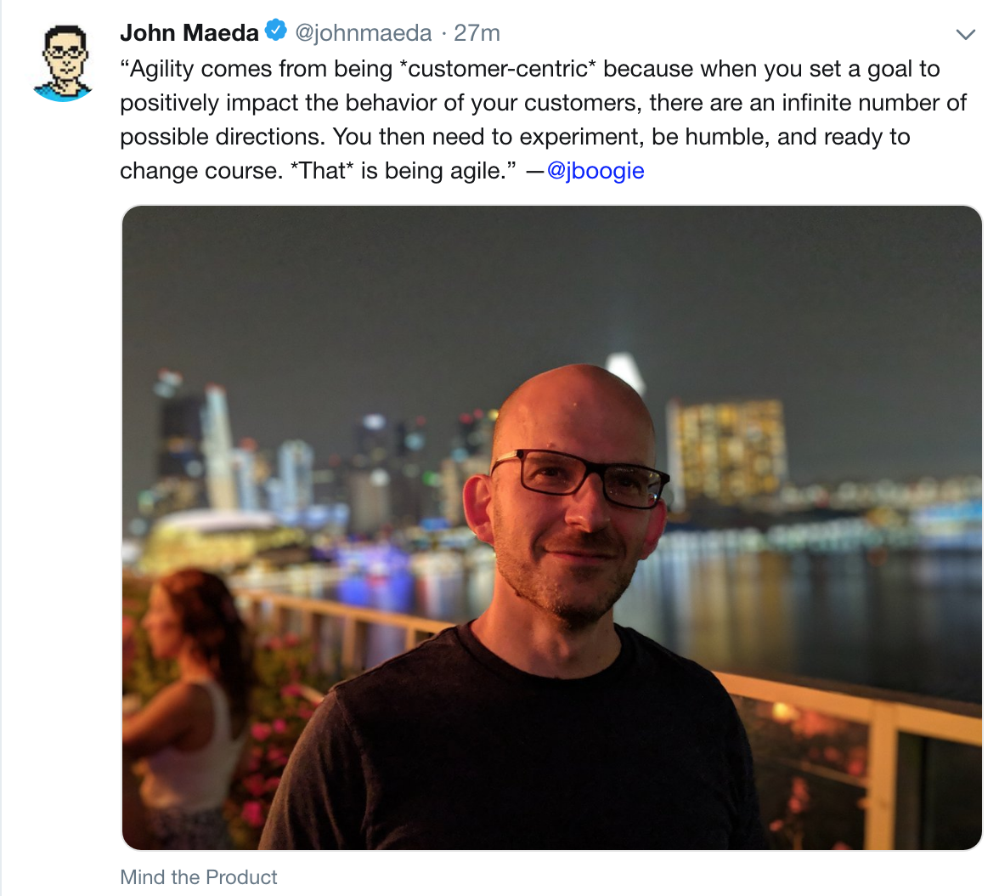

This is a very good quote:

> “Agility comes from being *customer-centric* because when you set a goal to positively impact the behavior of your customers, there are an infinite number of possible directions. You then need to experiment, be humble, and ready to change course. *That* is being agile.”

In other words, you can't design upfront correctly.

