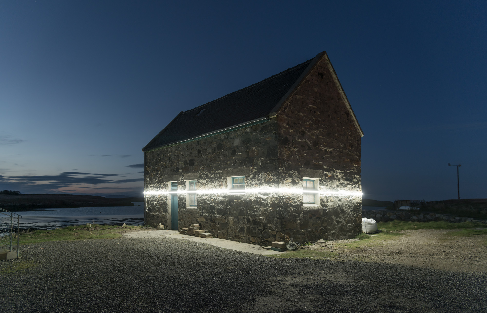

Light to visualize future sea level

[A beautiful site specific installation](http://www.niittyvirta.com/lines-57-59-n-7-16w/) that uses lights to represent the future sea level rise.

It's of course a typical design fiction project that try to arise awareness about a specific issue, provoking possible dialogues around it.

This is another example of a simple visualization idea in a powerful story.