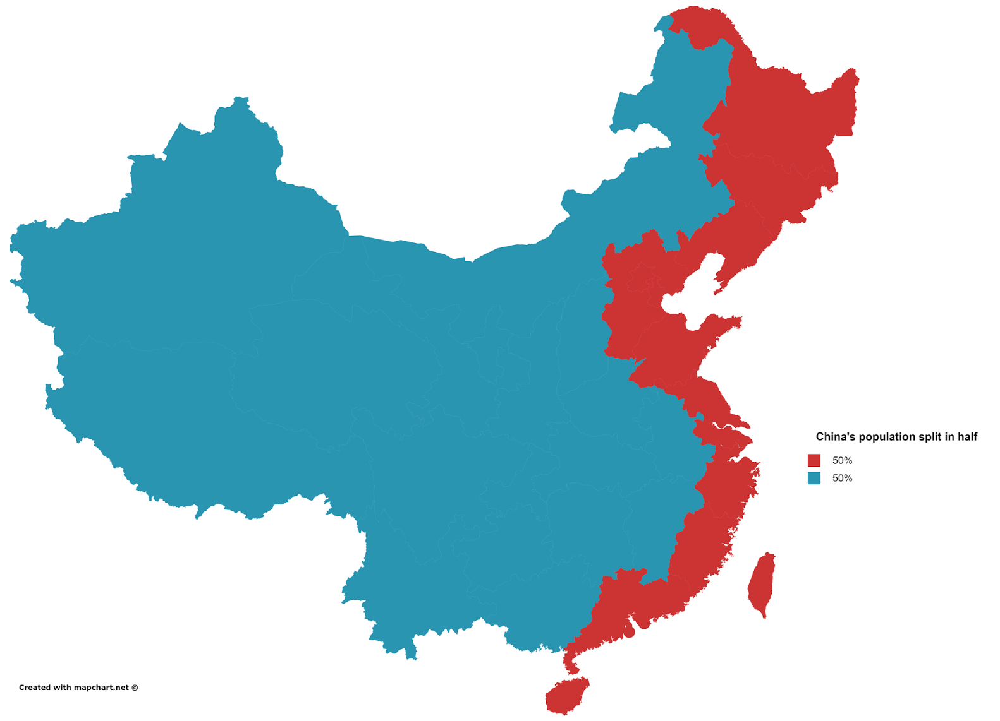

The chinese population

I love this visualization, simple and effective:

The power of this representation relies in the ability to map the population number (quantitative information) with the geographic dislocation in a very unconventional way, resulting in a very interesting comunication object.