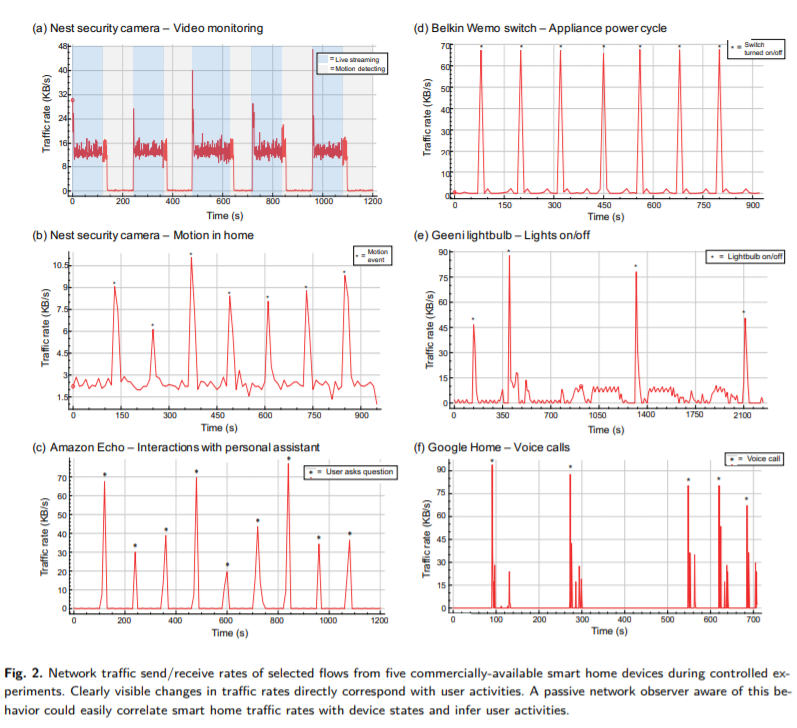

This is very interesting. IoT devices are going to be encrypted ever more but...

… there's a catch:

> Sniffing data traffic, even if encrypted, can reveal a lot about personal and private activities exposing some risks.

Here the [paper](https://arxiv.org/pdf/1812.00955.pdf).