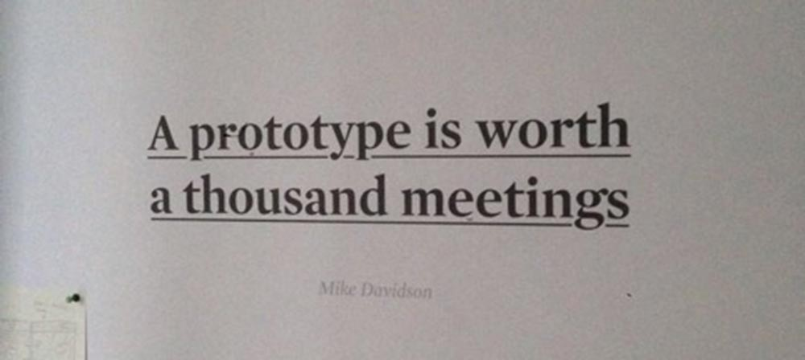

A **prototype** is *"an early sample, model, or release of a product built to test a concept or process or to act as a thing to be replicated or learned from."*

In design context, a prototype is everything since the inception to the final and released product. That means sketches, wireframes, visual comps, demos and all the early releases might be considered a prototyped version in order to improve something for the next cycle.

Prototypes are built with the explicit purpose of learning. Understanding is the product of a prototype. A prototype is meant to validate one or more assumptions. The design practice must be seen as a continuous state of prototyping. It's a way to put the team in an openness to learn position in order to be able to respond accordingly. Test over guess should be a mantra. 

What's important is not the first try but the second one: how the prototype has been improved based on the previous test.

