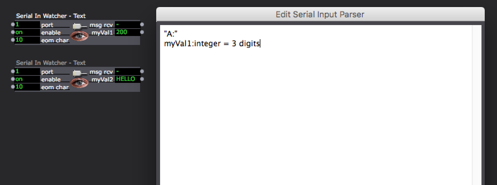
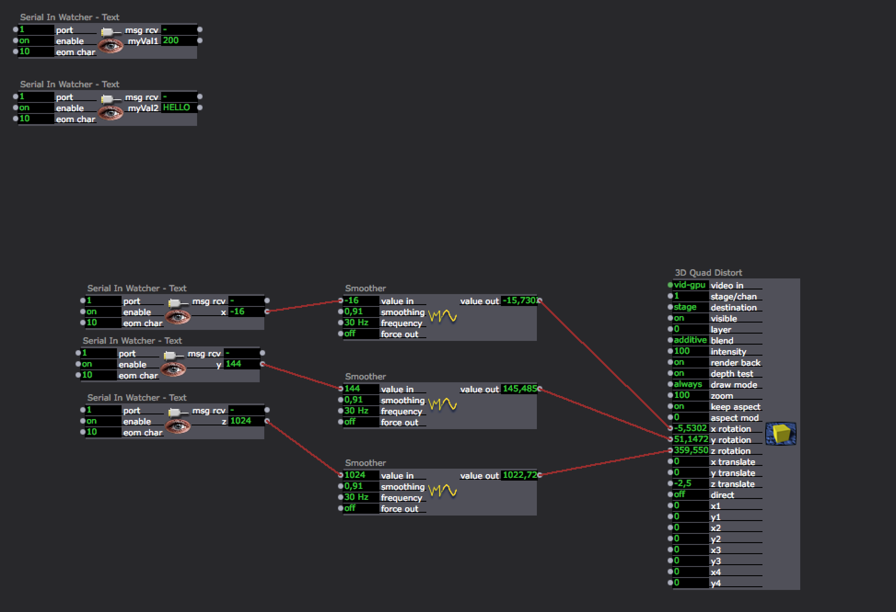

I had to manage, for a project, the communication between Isadora and an external device using serial signals.

The project is over now and I want to fix the bits I've learned somewhere.

The Serial In Watcher setup:

And a basic patch using the MicroBit microcontroller:

The following links were very useful:

- http://www.avk4.net/category/programming/isadora/
- http://www.dusxproductions.com/