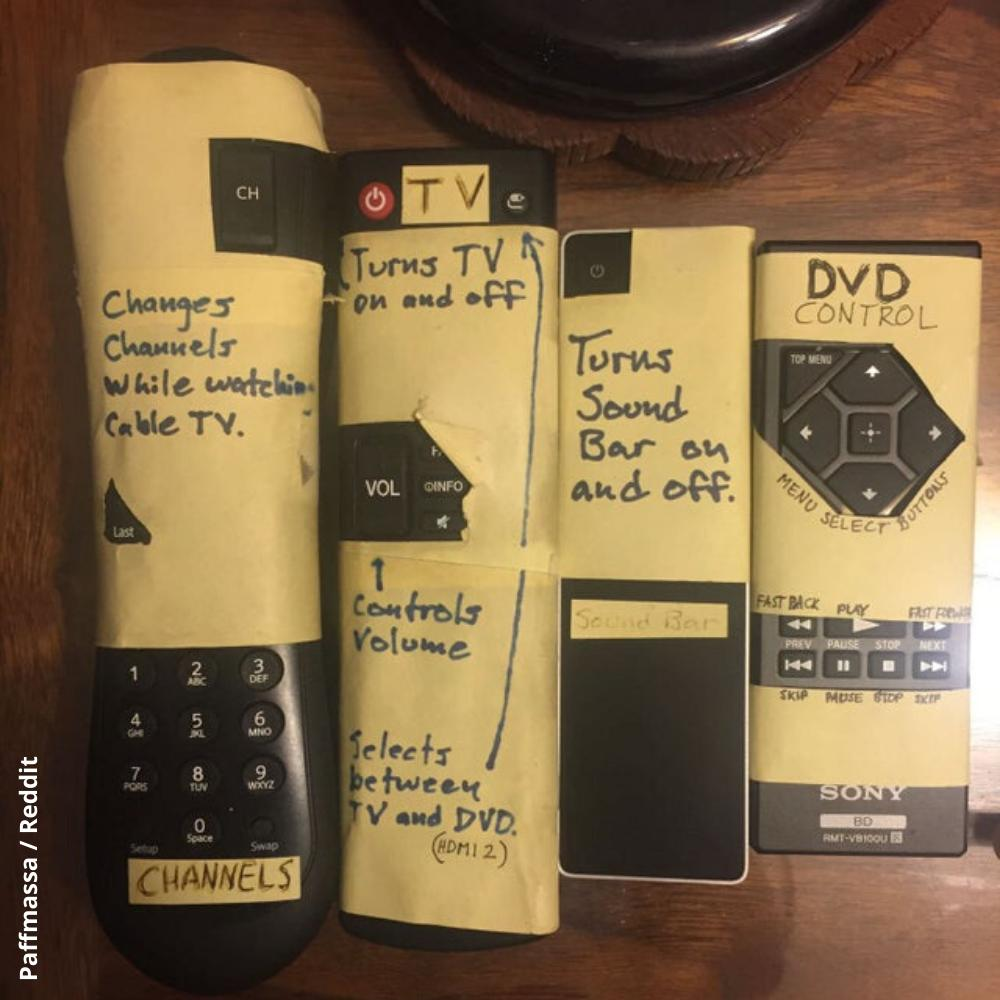

This is a classic in UX, the technical possibilities versus the real user needs always diverge.

The amount of this divergence determine the inverse quality of any design:

What's technical possible, usually an engineering task, needs to face with the user needs, a design task.