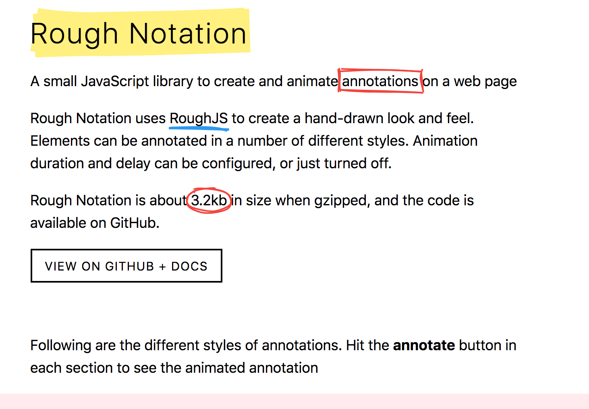

Rough Notation JS library

I've always thought about animated annotation in [PRESENTA](https://www.presenta.cc/) and this [library](https://roughnotation.com/) is a great candidate for a quick implementation.

Let's see.

