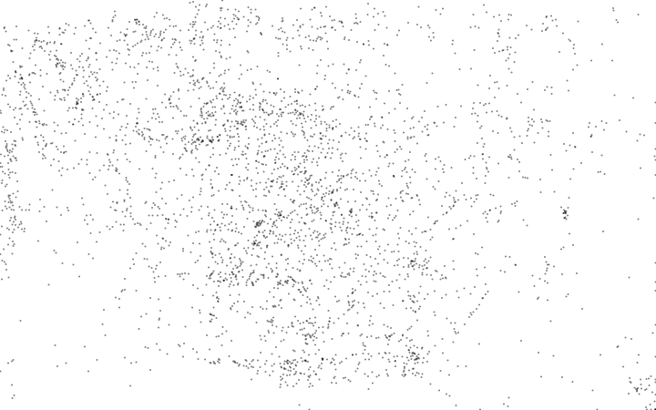
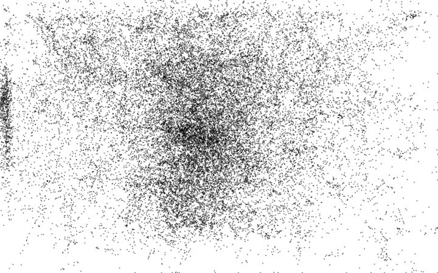
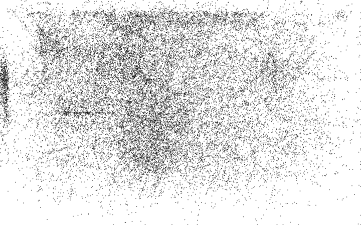
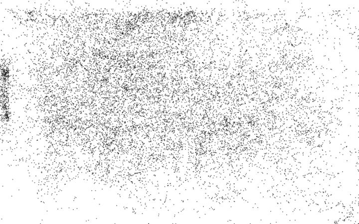
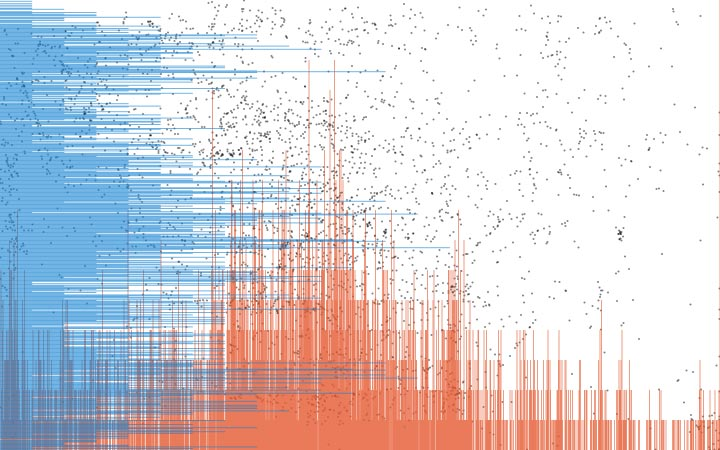
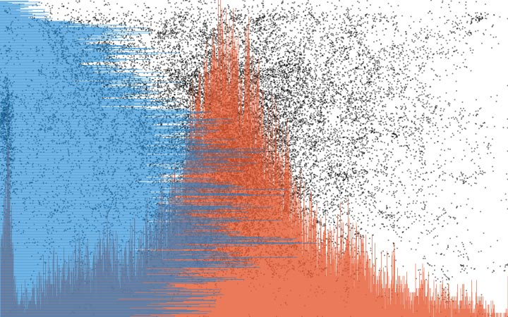
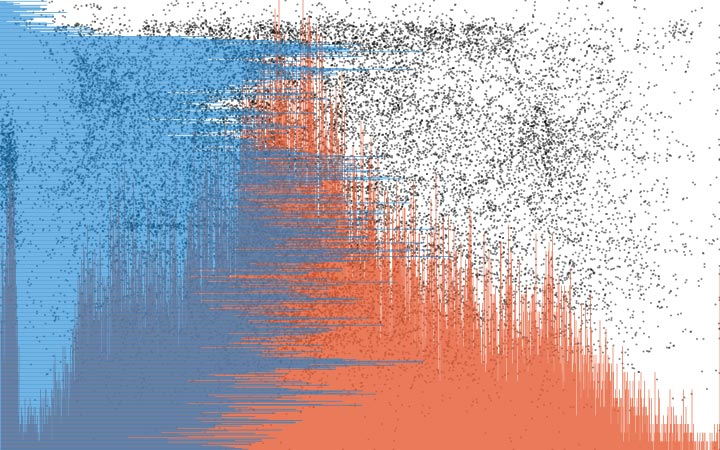
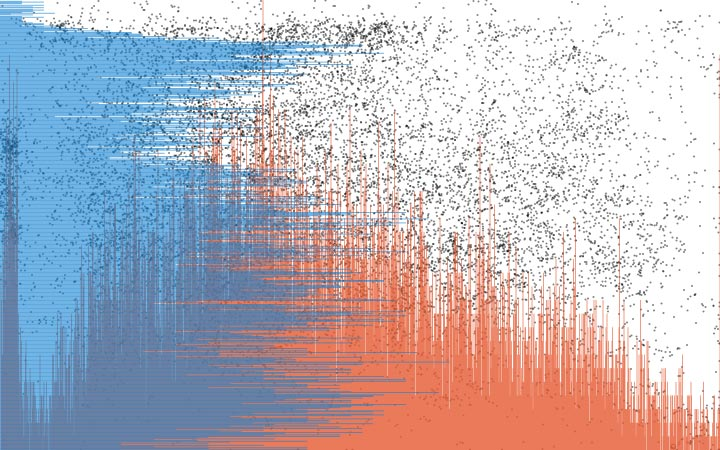

Last week I've released a [silly product](https://fabiofranchino.com/peep_my_mouse).  
A tiny digital toy to peep my mouse in real time.  
As I said, a silly thing.

It's based on a little daemon that watches my computer cursor advertising online its current properties.  
The step to collect and **archive** all these information was very close, though.

The original daemon has been built using **Node.js.**  
It was a matter of a couple of hours forking it in order to save every single data-point on a *CSV* file.

Just to be clear, I'm not a Node.js *ninja*.  
I use it sometimes for quick data transformation or as a communication middleware.  
Maybe this is why a little voice at some point told me something weird. It sounded like:

> Hey, dude! What about creating a *bot* or a *daemon* that fetch data somewhere producing automatically outcomes (i.e. visualizations)? Wouldn't it be amazing?

That intrigues me **a ton**.

## Daemon number two

Since the 6th of February, a little daemon sits on my computer collecting all the mouse information available on daily basis. Coordinates, pixel color underneath it and timestamp. A data point for each recorded mouse position on a specific time.  
In total, we are talking about from 10k to 30k data points per day, give or take.

I've waited one week before actively considering to visualise this data.
Usually, d3.js in the browser would be the first choice for that kind of task. 
*This time that little voice continued to push me.* 

> I've realized I should have done differently, learning something **new** just to make something **old**.

## Hello d3.js, I'm Node

Node.js doesn't know anything about the browser **DOM**. The *canvas* or *svg* element are simply undefined objects in Node context.

Luckily enough there's a canvas implementation for Node.js made by [Automattic](https://github.com/Automattic/node-canvas). It's pretty solid and powerful. There is also a DOM implementation but that is for another post.

So, after a bunch of hours I've set up a dirty *.js* script including d3.js, the Automattic canvas and some built-in node' libraries to handle file system operations.

Now I have a (cleaner) [script](https://github.com/fabiofranchino/follow_the_mouse_dumper) that can generate **zillion** of plot visualisations gathering datasets from a specific folder. Neat!

Now, show time:

It's not easy to extract meaningful insights out of them. You might notice the unusual dots concentration on the left side. 

I do use Mac OS X and my **dock** is left-centered positioned.

The next iteration includes histograms related to quantitative occurrences on specific coordinate positions. The red one is the quantity of data points in the **x-axis**, the blue one in the **y-axis**:

## So, what's the point?

Sticking always to something you know very well is **not** a good thing.  
Sometimes it's necessary to try out different stuff getting outside the comfort zone.

It's javascript after all, nevertheless I had to figure out a couple of things I wasn't aware.  
I could have built those visualisations in a more comfortable way.  
I'm happy I didn't do it.  
The time spent on learning new details, even though the actual basic results, has been rewarding.

Do something new today, you'll feel better.