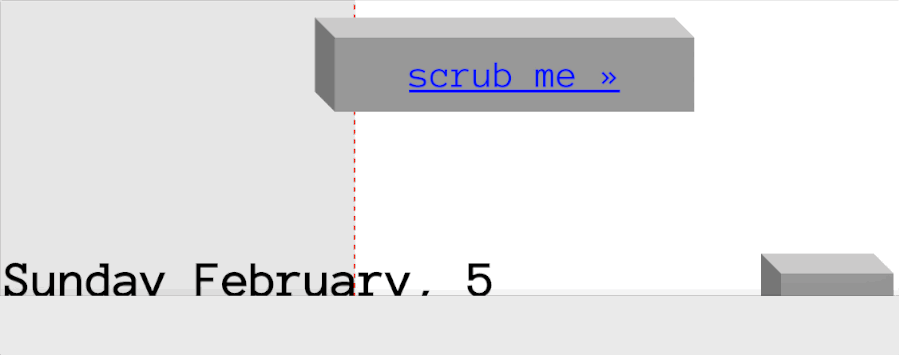

**TL;DR:** Go straight to the [toy](/scrub_the_mouse/) to explore my mouse activity.

## Previously on...

I've started this thing about first [advertising](https://fabiofranchino.com/peep_my_mouse/) and then [collecting](https://fabiofranchino.com/blog/nodejs-canvas-d3js-first-date/) my mouse activity just for fun.  
To be fair, everything started only to be able to say:

> Hey! I've demonized my computer!

This is going to continue for some weird reason, indeed this is another exploration step in the category of silly projects.

## What is about?

It's a simple interactive exploration tool for the sample data I'm referring above.  
Remember, we're in the silly land, therefore a silly tool is in order.

This *web-ui-toy* let you explore, visually and interactively, my mouse activity over time.  
It begins picking up a random day' dataset starting to show its whole journey.  
You can **scrub** the playhead to move back and forth like a vintage tape recorder, this is why the ui has this little touch of retro style.

## There's an issue

I need to explain the way how the samples are shown during the animation.  
The playhead is driven by the *index* position of the dataset array instead of the value of the current sample time.  

This is a stretch.  

The design decision is totally related to the time constraint I've set up for this project (few hours).  

This is definitely **not** an accurate representation because the time difference between samples is not honored from the visual point of view. If the mouse has not been used for a while, you won't see a stationary cursor for the same duration.

## d3.js to the rescue

While it doesn't look like a typical d3.js outcome, it's almost fully based on it.  

This was intentional.  

It was the opportunity to test **d3.js** on a (tiny) digital project that is far from the usual representation models of the library. Achievement unlocked!

> d3.js is great for UI digital product as well.

[Experience the toy](/scrub_the_mouse/) if you haven't already done.

And tell me what you think (on [@fabiofranchino](https://twitter.com/fabiofranchino)) about. Very curious.

Have a nice day!