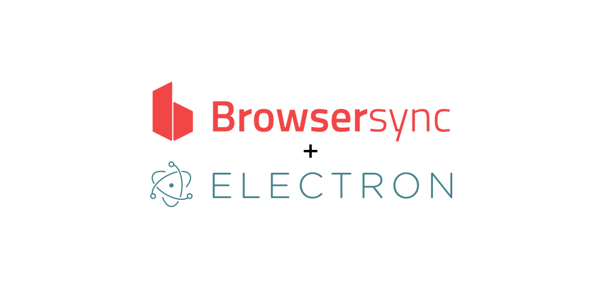

I'm going to introduce a new post type in this blog.  
It's about little tips discovered after a bit of research and test with the aim to find them again, more easily, the next time.  
It might also be useful for others, though.

**TL;RL:** To use Browser-sync with Electron use the recent **localOnly** option. It works like a charm.

<!-- main_ad -->



## Browser-sync

If you work in web design and development fields you already know how the process works:

- edit a chunk of HTML/CSS/JS
- save the file
- reload the browser to see the effect
- repeat

You should also know that those edits gonna be thousands in a project.  

If you already know that issue, there is a big chance you already know [Browser-sync.](https://browsersync.io)

Browser-sync is a super-mega time saver tool that simply refreshes the browser for you any time you edit a file during a development session.   
Even only considering half of a second for each edit to reload manually the browser, we are talking about days of time wasted in a long time project.

> Let's shine the computer on repetitive tasks like that one

If you don't know Browser-sync yet, I can't stress enough, [check it](https://browsersync.io/) right now.

## Electron

If you're able to design and develop a web app for the browser you're able to release it as native app too.  
[Electron](https://electron.atom.io/) makes that easy by removing all the hassles that don't belong to the web development field.

**Browser-sync works beautifully with the browsers but not when using Electron.**

## The solution

There was an interesting [discussion](https://github.com/BrowserSync/browser-sync/issues/1128) about the issue that brought to a new option specifically to work with Electron or similar environment.  
The **localOnly** flag allows supporting environments where dynamic hostnames are not required (ie: Electron)  
It was added in the [2.14.0](https://github.com/BrowserSync/browser-sync/releases/tag/v2.14.0) version of Browser-sync and can be used in the CLI like this:

```shell
browser-sync start --localOnly --files './app'
```

Don't forget to put the snippet of code provided by the shell into the .html files you're editing. The snippet is something like:

```javascript
<script async id="__bs_script__" 
src="http://localhost:3000/
browser-sync/
browser-sync-client.js?v=2.18.8 ">
</script>
```

With this setup, I can edit and see instant refresh of the Electron app on each little change. I can dev lightning fast on Electron projects too.

Cheers and carry a faster development on.