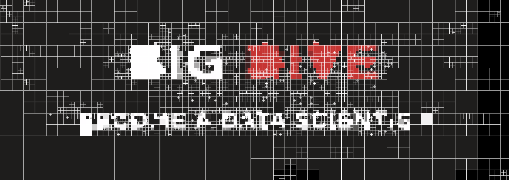

[Bigdive](http://www.bigdive.eu/), the training program to boost the technical skills to dive into the Big Data universe, turned to 6th edition and is coming very soon.  
Therefore, some updates are required in order to provide the most up-to-date and relevant learning experience to the next brave students.  
Indeed, the Bigdive visualization track will adopt the latest version of D3.js, saying goodbye to the v3.



[D3.js](https://d3js.org), the popular javascript library that allows to represent data in graphical forms, got a major update, with the version 4, early the last summer.

A major update usually means **breaking changes** in the API therefore a bit of learning is required in order to embrace it in your projects.

Thanks to a pretty solid API model, most of the version 3 syntax is perfectly compatible with version 4 of the library.
**Most** which means that **some** won't work anymore due to library API changes.  
Some are subtle since they rely only on simple object renames.  
Addressing these changes are often a no-brainer but at the same time it takes time to internalize and learn them properly.

Before to start, it might be a good idea reading official resources that may introduce to the transition.  
There are two primer sources to get, to say the least, a glimpse of the extent of these changes.  
The official [Changes in D3 4.0](https://github.com/d3/d3/blob/master/CHANGES.md) documentation and a [103 skimmable slides](https://iros.github.io/d3-v4-whats-new/#1) from [Irene Ros](http://twitter.com/ireneros), just as a start.

This post is a first collection of tips from  real world examples to survive the transition easily, based on personal experience and after acknowledged the mentioned references.

## Transitions

Basic transition set up is pretty similar in v4.  
This is a tipical transition in a d3.js selection that works both on v3 and v4 as well:

```js
svg.select('circle')		
    .attr('r', 40)
    .transition()
    .duration(2000)
    .attr('r', 20)
```

#### Easing

Easing in transitions got a change since it doesn't accept literal string definition anymore. It needs an object reference of the desired curve that belong to the [d3-ease](https://github.com/d3/d3-ease) package.  
The old way to define a easing curve was something like:

```js
.ease('buonce') 
```

now the same can be accomplished with:

```js
.ease(d3.easeBounceInOut) 
```


#### End of transition callback

If you want to call a specific function on transition end, this was the line you could add in your chain:

```js
.each('end', endTransition)
```

Now the same effect can be done with this slightly syntax change:

```js
.on('end', endTransition)
```

#### Delay per transition in multiple transitions chain

This is a new feature, long awaited. Adding a delay on the latter transition would break the code in version 3.

```js
svg.select('rect')
        .attr('width', 100)
        .attr('height', 0)

    .transition()
        .duration(1000)
		.delay(500)
        .style('fill', 'orange')
        .attr('height', 100)

    .transition()
		.delay(500)
        .attr('width', 200)
        .style('fill', 'red')
        .style('opacity', .5)
```

Now, in version 4, delay per transition will be take into account properly.

Remember that you can use the end transition callback for each transition in a single chain like:

```js
svg.select('rect')
        .attr('width', 100)
        .attr('height', 0)

    .transition()
        .duration(1000)
		 .delay(500)
        .style('fill', 'orange')
    .on('end', endTransition1)

    .transition()
	 	 .delay(500)
    	 .style('fill', 'red')
    .on('end', endTransition2)
```


## Scales

Scale is one the most common object you may find in D3.js code.  
It's very common because it's very useful and ease to use.  
Due to the modularity nature of version 4, **scale** objects need to be used with a different name:

#### Linear scale

Setting up a scale object require usually this kind of code:


```js
var scale = d3.scale.linear()
  .domain([0, data.length-1])
  .range([0, 100])
```

Now you need to refer to the new object name:

```js
var scale = d3.scaleLinear()
  .domain([0, data.length-1])
  .range([0, 100])
```


#### Color scale

We used to use the built-in color scale for easy exploration when defining different categories in visual elements.  
This is the typical code:

```js
var colors = d3.scale.category20()
```

This need to be changed a bit in version 4 as:

```js
var colors = d3.scaleOrdinal( d3.schemeCategory20 )
```


## Axis

The axis object got small syntax changes as well. Assuming that **scale** and **format** variables are properly set:

```js
var axis = d3.svg.axis()
    .scale(scale)
    .orient('right')
    .ticks(5)
    .tickSize(1)
    .tickFormat(format)
```

Like other objects, you need to refer to the new object name and no need anymore of the **.orient()** call since it's implicit in the object name:

```js
var axis = d3.axisRight( scale )
    .ticks(5)
    .tickSize(1)
    .tickFormat(format)
```


## Path generators

Generally, the svg generators have lost the **svg** package name path so instead of this syntax:

```js
var arc = d3.svg.arc()
    ...
    
var line = d3.svg.line()
    ...
    
var area = d3.svg.area()
    ...
```

we need to refer to each generator directly:

```js
var arc = d3.arc()
    ...
    
var line = d3.line()
    ...
    
var area = d3.area()
    ...
```

the additional setting method are usually the same of version 3.

That's all for now. 
This is the first round of tips to take into account when writing d3.js code for version 4.

Please feel free to contact me if you have any questions, suggestions or follow me to get notified about next updates.

Have a nice day.