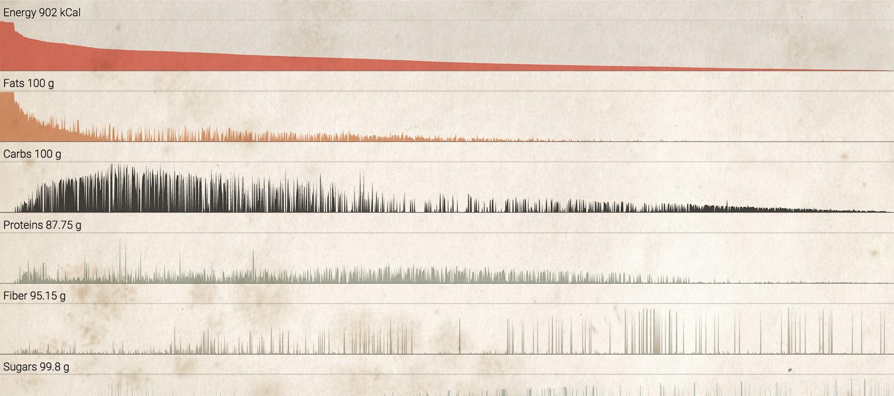
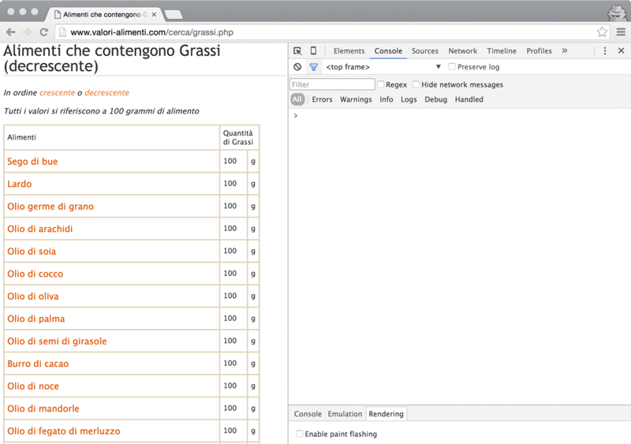
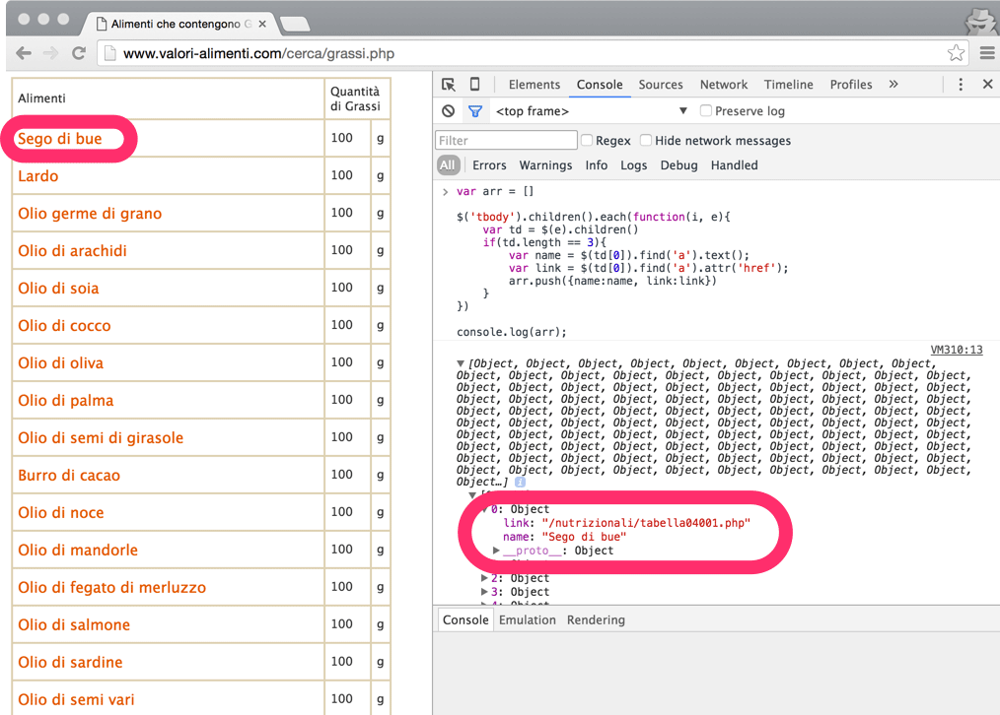
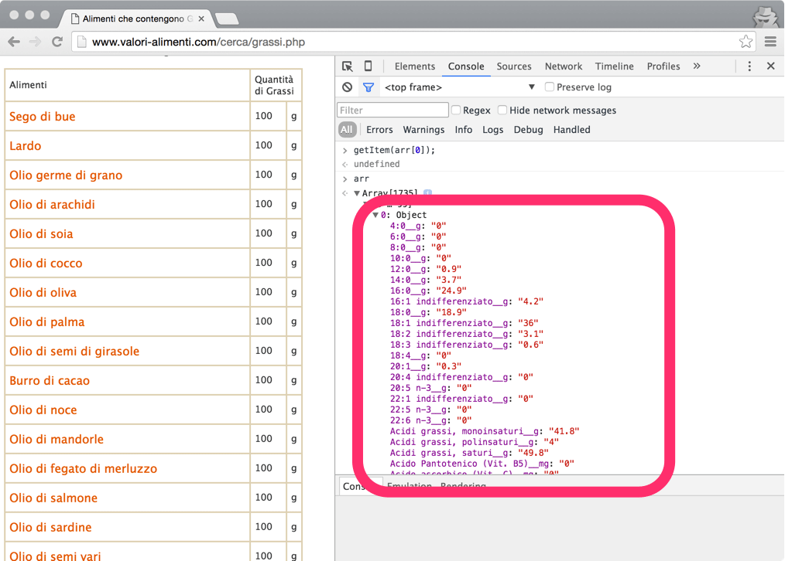
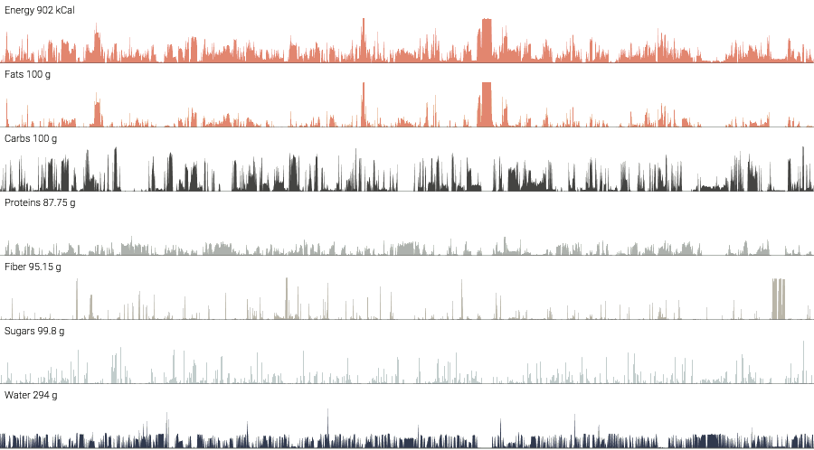

**TL;DR:** A little journey on scraping nutrition data for visualization purpose.

---

I like cooking.

I can even humbly to say I’m pretty good at it. I like to be creative when in front of stove and pots, I usually try to experiment a lot using the combination of two of my senses as the main driver.

Unfortunately, I’m not very educated in nutrition. I’m usually not spending my free time reading/browsing technical papers about it. I would like, though.

I feel myself much more confident on working with data trying to understand it in order to transform into something visible, hopefully helping other people get something meaningful from.

This is why I was pretty excited the day I’ve stumbled upon on [this](http://www.valori-alimenti.com/) Italian website, a collection of popular food items alongside details and percentages of main and secondary nutrient elements.

I remember the first instinct I had that was to immediately take the data and start tinkering with it. I would have had the possibility to play with interesting data that it would have provided me some basic knowledge on the topic, a starting point for further elaborations.

Sadly, it’s a traditional website that exposes a database with a list of links, detail pages and relations with categories. It’s a website for human beings, machines were not taken into account. Indeed, there isn’t any public API available.

I have to admit: later on, I would have discovered the original source ([http://ndb.nal.usda.gov/](http://ndb.nal.usda.gov/)) which is much more up-to-date, extensive and, most importantly, does provide an open and public API to interact with. Discovering that, it would have to avoid me to do what I did and this post wouldn’t have never existed.

Since at that time I didn’t check the information page which would lead me to the original source, I went to the hard way:

> I want that data and I want it now so let’s scrape it.

## Web scraping

According to Wikipedia, **web scraping** is a computer software technique of extracting information from websites with a focus on the transformation of unstructured information, present on the web, into structured data that can be read by machines.

Web scraping is a subset of the more generic field data scraping, from its definition I would highlight this lovely sentence:

> “An ad hoc, inelegant technique, often used only as a *last resort* when no other mechanism for data interchange is available.”

Writing code for the sole purpose of scraping usually means writing quick, ugly and inefficient code, code that is disposable by design.

I’ve always been fascinated by this odd activity since it’s like it has given to us a special power to inspect any public source of information in order to rearrange them for further purposes.

In some way, it forces us to understand the underlying structure of the information that is in front of us.

Web scraping can be performed with a variety of tools and techniques. In my humble opinion, the best tool that suite this activity is the same that is used to gather and display the information: the browser.

Modern browsers allow to interact with web pages with powerful tools, the same tools that usually are used by developers.

Of course, there are other, less technical, options out there that can be used to collect information into structured forms (import.io, webscraper.io to mention a few). I’m not here advocating any particular one, indeed, I’m suggesting to try the custom way, and the reasons why are:

- It’s **easier** and **faster** (once you’re confident on writing simple javascript code)
- Rely on a **generic technical knowledge** instead to a specific tool skill
- It’s **abstract** (you are the designer of the system rules)
- It’s **scalable** (you can use the browser for quick scrape or run a server for massive activities)
- You’ll **learn** every time something new (that you could use in other situations)
- It’s **fun** ([or it could be](https://blog.hartleybrody.com/web-scraping/))

## Hands On!

Here I’m just showing you the quickest way to set up a scraping session since everything you need is a browser (I bet you have one but I would suggest using Google Chrome), a bit of javascript understanding and the right amount of curiosity.

For a more in-depth, still basic, tutorial with a more structured system setup I would suggest reading [this article](http://datajournalismhandbook.org/1.0/en/getting_data_3.html) from "The Data Journalism Handbook".

So, assuming you are using Google Chrome, this is what you need to do:

- open in a new tab [this URL](http://www.valori-alimenti.com/cerca/grassi.php) which is our starting page
- open the Chrome DevTool and the Console tab (Opt+⌘+I or Ctrl+Shift+I)
- open in another tab [this link](https://code.jquery.com/jquery-2.1.4.min.js) in order to grab (copy into the clipboard) the full source of jQuery, then close it
- back to the first tab, paste the full code into the Console panel and hit ENTER

Now that we have injected jQuery into the original page, we can exploit it for our purposes (yes, we could avoid jQuery at all by writing [vanilla](http://vanilla-js.com/) javascript but it’s easier and faster with it).

From that page, we have the complete list of food items, each of them with its proper link to the details page.

The following tiny code snippet will be responsible for transforming that list into a structured javascript array with 1736 objects:

Look the relation between the readable information and the data object

Now with the complete list in memory, we can fetch the details page for each item in order to decorate each object with all the available properties.

To complete the tutorial check [this repository out on Github](https://github.com/abusedmedia/Scraping-data-in-the-kitchen), a better place to store stuff like that.

The same data object has been decorated with additional properties

This is a quick demonstration to show how to scrape any public website using few lines of javascript. I really hope I have given, at least, a bit of curiosity to try to scrape with your hands.

It was worth nothing whether I wouldn’t, at least, try to use that data for a potential visualization and see what might be come up.

It’s interesting to see that there is already something (may I call them *insights*?) that can potentially lead to some direction.

[Experience and enjoy the visualization](http://bl.ocks.org/abusedmedia/bfc42ae0b4888f8843da)

