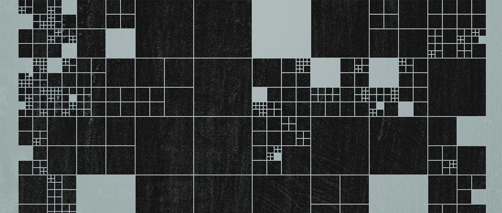
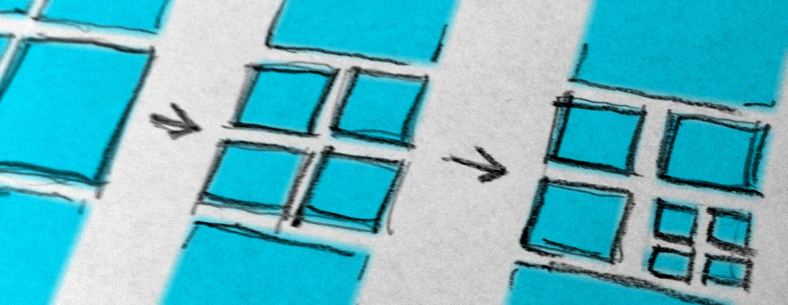
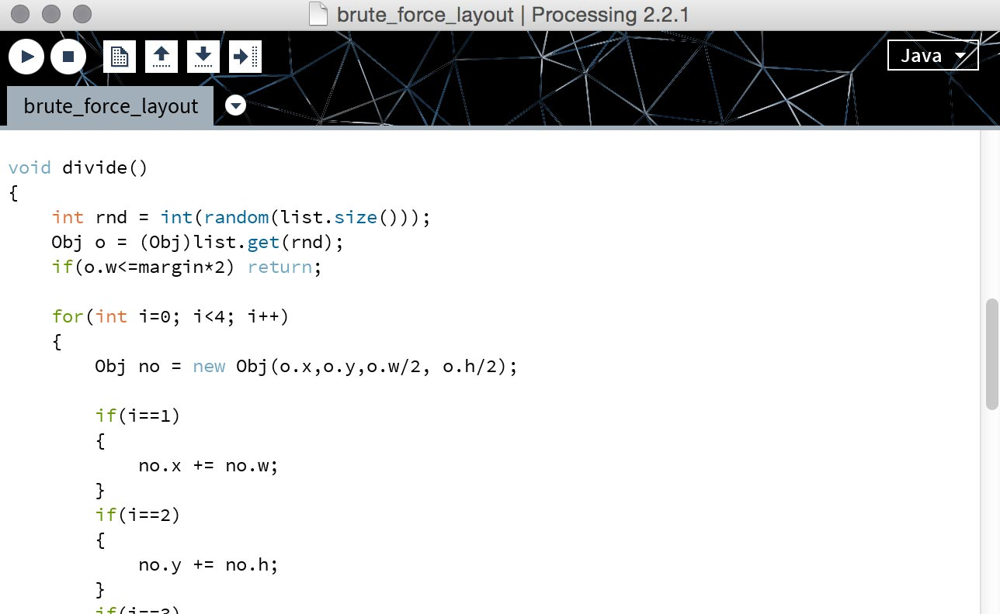
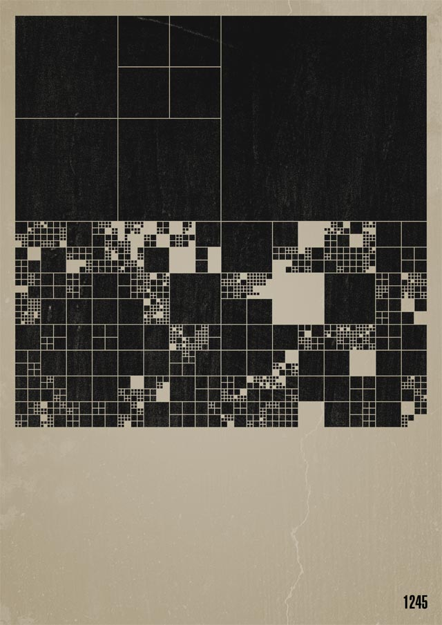
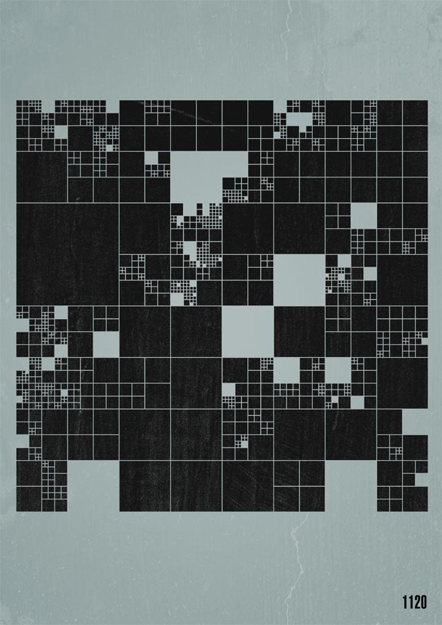
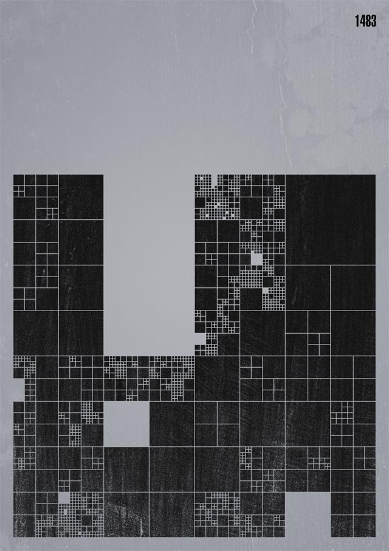
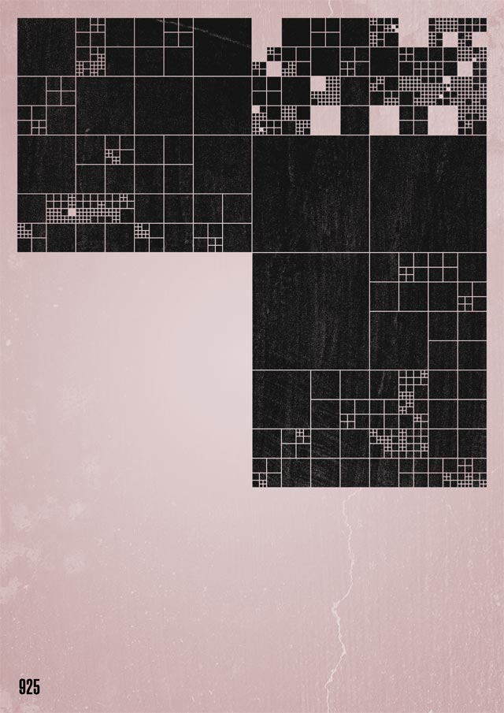
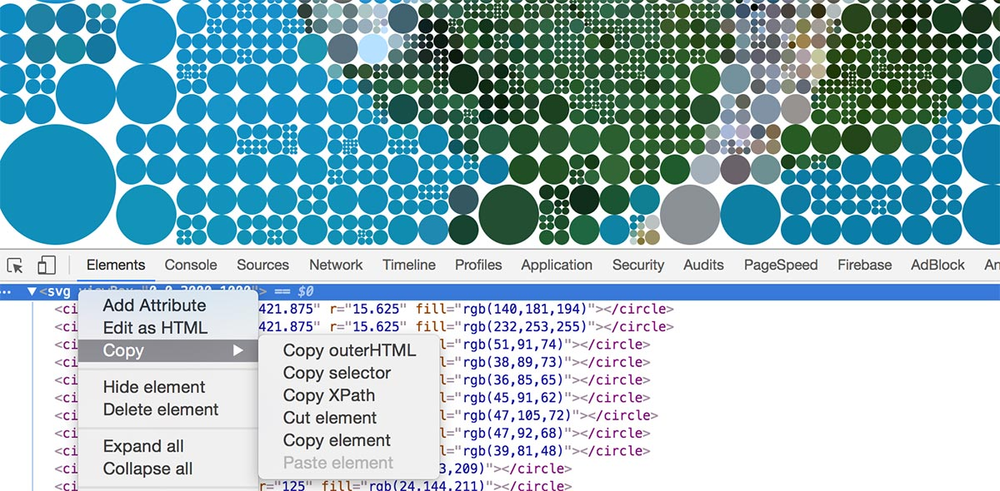

**TL;DR:** A visual exploration on grid system with creative coding

---

I’ve been fascinated by **complex structures** since always and grid systems don’t make an exception.

In graphic design, a grid is a visual structure that usually serves as a framework on which a designer can organize graphic elements in a rational way.

It’s a tool, a functional tool with a technical purpose, invisible to the final user/reader, without any pretense to be aesthetic.

This might be the reason why one day I’ve started questioning myself on few different trajectories:

- What if we try to visualize it?
- Can it be aesthetically meaningful?
- How can we conduct a visual exploration on complexity considering the rigidness nature of a grid system?

## A beautiful grid

It was a day in 2011; I was probably thinking about grid systems, beauty, complexity and the intersections in between. That day a tiny exploration has been born.

The seed was simple:

> let’s try to generate a visual grid using a system of rules trying to explore complex visualizations within the graphic design field.

Out of it, a simple set of tasks were outlined, defined as the follows:

1. Given a list of rectangles on canvas, pick one up randomly
2. Divide it in 4 halved rectangles
3. Repeat
4. Sometimes remove a rect picked up randomly

These simple rules can be manually executed producing simple results. The same simple rules are able to produce complex outcomes if iterated multiple times properly.

This ended up to be a good opportunity to exploit some computational strategies by means of software and code.

## Processing to the rescue

In 2011 [Processing](https://processing.org/) was still my Swiss Army knife to solve creative and visual problems. The sketch is quite small and doesn’t rely on any other library.

Full disclosure: the code has been written **fast** with the sole purpose of visual exploration. For that reason, it may appear rough and inelegant.

You can take a look at the whole sketch [here.](https://gist.github.com/abusedmedia/bb4761a4d259e97a419a235e386a26f3)

The sketch was able to generate infinite permutations of the visual structure but I’ve saved only four variations eventually becoming the following manually fine-tuned graphic posters:

I was pretty happy with the outcome and, at that time, the thing was done there.

## Resuming in 2017

Nowadays my tool of choice for almost any kind of visual exploration relies on the web platform. For that reason, I’ve spent a bit of time porting the Processing sketch into plain javascript/jQuery code.

And no, I didn’t use [processing.js/p5.js](https://p5js.org/) on purpose, for several reasons that I’m not mentioning here.

The new sketch runs using an empty SVG as canvas and here you can see it in action:

<iframe class="fuildframe" width="3000" data-width-mobile="1000" height="1000" src="http://fabiofranchino.com/brute_force_layout/sketches/01.html" frameborder="0"></iframe>

You can tweak with this version on [Codepen.](https://codepen.io/abusedmedia/pen/oBxQgM)

## Iteration

One the best thing when you have a source code in front of you is the possibility to tweak it over and over getting different and unexpected results fast.

Iterating with code is a **truly creative process** that might be also very fun.

Actually, the algorithm runs by itself without any way to influence its process. Every iteration does initiate another iteration.

Changing that part of the process might be interesting in terms of exploration possibilities; let’s do it using the mouse movement and position as driver:

<iframe class="fuildframe" width="3000" data-width-mobile="1000" height="1000" src="http://fabiofranchino.com/brute_force_layout/sketches/02.html" frameborder="0"></iframe>

We know that every single rect can be manipulated further. What about adding a further variation on a specific property? Here the next iteration adding one line of code to change the opacity, randomly:

<iframe class="fuildframe" width="3000" data-width-mobile="1000" height="1000" src="http://fabiofranchino.com/brute_force_layout/sketches/03.html" frameborder="0"></iframe>

The color is an important property to deal with. Again, assigning different fill color for each rectangle might be interesting in terms of creative outcome.

Instead of putting a random color value which might end up to something not very pleasant, here a popular technique to get both a consistent color palette and proper assignment borrowing this information out of a picture:

<iframe class="fuildframe" width="3000" data-width-mobile="1000" height="1000" src="http://fabiofranchino.com/brute_force_layout/sketches/04.html" frameborder="0"></iframe>

So far, the rectangle has been the shape of choice but what about trying another one? Let's try with a circle alongside a bit of animation:

<iframe class="fuildframe" width="3000" data-width-mobile="1000" height="1000" src="http://fabiofranchino.com/brute_force_layout/sketches/05.html" frameborder="0"></iframe>

As you might start noticing, each variation is nothing more than an answer to a *"what if?"* asked to the previous sketch.

I could continue forever but I’m stopping here.

Or I could export these artworks onto Illustrator (or similar vector editors) in order to integrate them with other compositions.

> **Bonus tip:** Export is just a matter of copying the generated source SVG code *(copy element)* and put it into an empty .svg file:

Do you want to tweak and continue the exploration by your own? Check or [download](https://github.com/fabiofranchino/brute_force_layout/archive/master.zip) the source code from [this repository](https://github.com/fabiofranchino/brute_force_layout) and let me know if you reach something else.

## Opportunity

I truly believe in the potential of software in aesthetic contexts. Writing quick code scripts to foster the creative process should be taught in every design schools.

There is a huge debate about whether designers should be able to code or not. My point is simple: learning how to code doesn’t hurt unless you’re pretending to become a developer in a short period of time.

It’s all about the purpose: start learning how to write a simple chunk of code today. Don’t judge it too soon. Worst case scenario? You’ve learned something new, **something that is going to expand your way of thinking.**

---

**Thanks for reading and please share!**

For quick feedbacks or see what’s next, follow me on [Twitter](https://twitter.com/fabiofranchino). You can write me also via [email](mailto:hello@fabiofranchino.com).

Have a nice day!

---

Thanks to [Greta](http://www.greatgreta.com/) and [Luca](http://www.01temp.it/) for reading drafts of this.