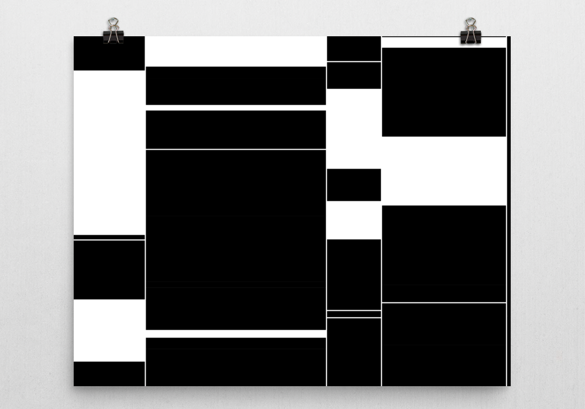

CSS looks easy at first glance but it's not.  
Mastering CSS requires a lot of practice.

One of the best ways to improve the tech skills is by pushing some pieces of them to some limits.  
Limits don't have to be hard nor complex.

This is an example of how to reach some interesting outcome trying to push a little piece of technology out of its usual context.

CSS is the web technology used to style contents.  
Lately, CSS has become powerful enough to built complex layouts and animation effects.

> Indeed, the browser is pretty smart at computing complex layouts these days. 

Speaking of which, we cannot avoid mentioning the CSS Flexbox module.

### Playing with Flexbox and Javascript

[Flex specification](https://developer.mozilla.org/en-US/docs/Web/CSS/CSS_Flexible_Box_Layout/Using_CSS_flexible_boxes) contains multiple properties to allow defining precisely how each element has to behave within its parent and alongside its siblings.

In this case, it's all about exploiting the [flex-grow](https://developer.mozilla.org/en/docs/Web/CSS/flex) property that is responsible for **weight** the size of each element based on the total weight of all siblings, a weight that will be converted in pixel dimension according to the available space of the parent container.

With the help of javascript, it's possible to play with it in order to generate a bunch of elements at run-time giving to each an arbitrary flex-grow value:

<iframe class="fuildframe" width="3000" data-width-mobile="1000" height="1000" src="https://fabiofranchino.com/flex-ible-pattern-generator" frameborder="0"></iframe>

You can play with the source code in this [pen](https://codepen.io/abusedmedia/pen/ZKGEoj).

Have a nice day.
