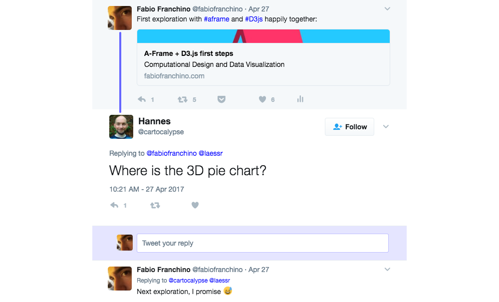

> A promise is a promise.



I did it. I've built the unspeakable, the unmentionable and possibly the worst piece of data visualisation ever invented by the human specie. 

May I present my 3D pie chart in all its glory in VR world:

<iframe class="fuildframe" width="3000" data-width-mobile="1000" height="1000" src="https://fabiofranchino.com/3D-pie-chart-finally/01.html" frameborder="0"></iframe>

[A-Frame](https://aframe.io/) makes it ease thanks to the geometry properties of the cylinder. Here the markup to build a single slice:

```html
<a-entity geometry="primitive:cylinder;
            radius:1;
            thetaStart:0;
            thetaLength:90;
            height:1;
            openEnded:false;" 
          material="side: double; color:red;" 
          rotation="70 20 0" position="0 2 -4"></a-entity>
```

The key here is the *thetaStart* and *thetaLength* allowing to define the start and the end angles of the slice.

Since **startAngle** and **endAngle** are properties of the [D3.js Pie layout](https://github.com/d3/d3-shape/blob/master/README.md#pies), I can't help but built the 3D pie using D3.js and some fake data, so here it is ready to be included in your next Powerpoint VR presentation:

<iframe class="fuildframe" width="3000" data-width-mobile="1000" height="1000" src="https://fabiofranchino.com/3D-pie-chart-finally/02.html" frameborder="0"></iframe>

Here the relevant portion of the script responsible for the task:

```javascript
d3.select('a-scene')
    .selectAll('a-entity')
    .data( pie(data) )
    .enter()
    .append('a-entity')
    .attr('geometry', function (d, i) {
      var a = d.startAngle * 180 / Math.PI
      var b = (d.endAngle - d.startAngle) * 180 / Math.PI
      return 'primitive:cylinder;radius:1;thetaStart:' + a + ';thetaLength:' + b + 'height:1;openEnded:false'
    })
    .attr('material', function (d, i) {
      return 'side: double; color:' + colors(i) + ';'
    })
```

I'm still trying to figure out how to better use this kind of visualization in VR space (joking).

<iframe class="fuildframe" width="3000" data-width-mobile="1000" height="1000" src="https://fabiofranchino.com/3D-pie-chart-finally/03.html" frameborder="0"></iframe>

I believe I've had enough of pies.  
If you've had too, [join us](https://goo.gl/0GLSb3) this summer contributing to this awesome learning experience in Lugano:

<a href="https://goo.gl/0GLSb3"></a>

As usual, full source code [here](https://github.com/fabiofranchino/3D-pie-chart-finally)