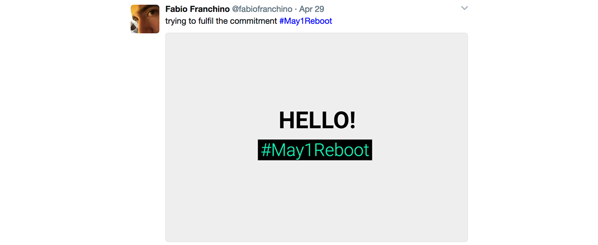

I do like the [#May1Reboot](http://www.may1reboot.com/) initiative:

The campaign has been almost completely advertised through Twitter, therefore, I got curious to see some numbers related to people that used it to promote the initiative and their own relaunch as well.

I've set up a little Node.js script to scrape tweets from a public search. I didn't use the API since the limitation of 7 days you can search back in the past.   
Instead, I've used the public search in the webapp to overcome this limitation.

The script, beside the collecting activity, saves each tweet in a comfortable json file in order to be used later on. 

The script can also be run multiple times in order to update the json file with new tweets that happen to be included in the same search. This way you can run the script on different days without retrieving all the tweets since the beginning but only the fresh one.

I'm planning to visualize the #May1Reboot tweets collection in some way in the coming weeks.   
I just thought this script might be useful to someone who needs to dump tweets based on a public search.

Source code with instructions [on this repo](https://github.com/fabiofranchino/dump-tweets-from-search).