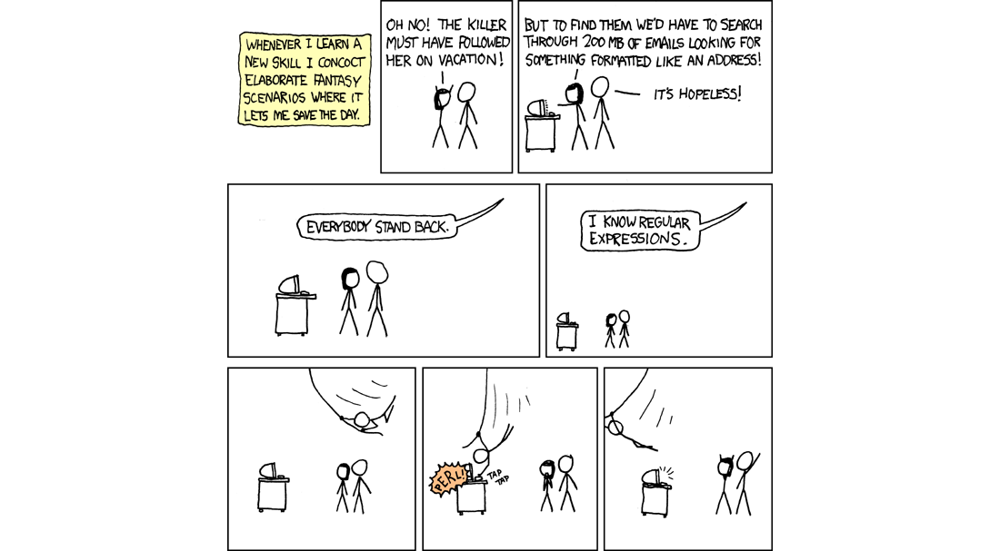

If you consider the [Regular Expression](https://en.wikipedia.org/wiki/Regular_expression), RegEx to my friends, a language for **aliens**, well, nice to include you in my company!



Maybe you already know that it basically allows to find sequences of characters by means of pattern rules. 

You might even know that since everything on our computer can be represented with characters, they can help tons in terms of data manipulation and transformation.  

No matter your knowledge level on the topic, you've been always fascinated and curious about how it works and attracted by its potentials as well.

## Learn the shit

A year ago I've taken action and started to learn the basics of regular expressions.  
I've used [RegExOne](https://regexone.com/), a great resource to learn regex with simple and incremental step by step tutorials with interactive exercises to test out what you've learned.

I've followed all the lessons alongside all the exercises but, to be fair, I was far to be confident using it in real-world projects.

Despite that, I've started to use it from time to time going to avoid some spaghetti code to solve little problems in projects.

I'm still learning it. I'm not confident using it without some helper tool like [Regexr](http://regexr.com/), which, by the way, I strongly suggest to try it out.

Watching a reg-ex still makes me cringe but I can write simple expressions without much troubles.

Recently, I had to extract valid URLs out of an array of texts and the following snippet fit the task perfectly:

```javascript
var url = mytext.match(/https?:\/\/\S*/g)
```

It returns an array with all the valid URL found in a given text source. You can see it in action [here](http://regexr.com/3g1pv).

The logic behind that dark piece of string is surprisingly easy to learn and could be outlined as the follows:

- "/" A regular expression starts always with the reserved char **/**
- "http" find any word that begins with **http**
- "s?" optionally includes words with or without the letter **s** after the first pattern rule (resulting with http or https) using the special char **?**
- ":" continue to find words that have also a semi-colon after the previous tokens 
- "\/\/" continue to find words that include also a **//** (since the / is a reserved char, we need to escape them with the back-slash, therefore, \/\/ means double slash) after the previous tokens
- "\S*" finally, continue to select words that include also any alpha-numeric characters other than spaces (with the specific command **\S**) and continue until the condition won't be met anymore
- "/g" close the expression with **recursion**, that means find multiple occurrence.

## It's hard

Mastering regular expressions require dedication and don't happen quickly.

I feel you. You are so scared by this *just-a-little-bit opaque*, but very efficient, tiny language.  
And yes, you can learn it.