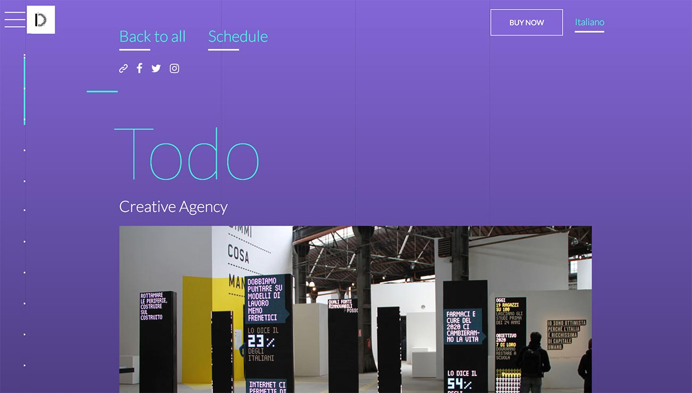

I was lucky enough to attend the [Digital Design Days](http://www.ddd.it/) festival held a few days ago in Milan.  
We, as [TODO](https://todo.to.it/), have been invited to give a speech there, together with an incredible line-up of design studios and designers.

Giving a public talk is always, beside disseminating the studio brand, an opportunity to share thoughts trying to inspire people or, at least, to entertain them.

But participating in a festival is also an opportunity to **listen** and **learn** from others interesting people.  
**DDD** is no exception.  
In this post, I'd like to share briefly what I've learned out of it.

The program of the **DDD** festival, like any similar events, is full of talks and most of them overlap due to the compressed time frame of the programme.  
I've attended some of them ([Epic](https://www.epic.net/), [Moment Factory](https://momentfactory.com), [Resn](http://resn.co.nz/), [Unit9](https://www.unit9.com/) and [Losiento](http://www.losiento.net/), naming the most interesting), nevertheless that, I've seen some patterns and common principles related to running a design studio these days I'd like to share with you:

- Agile principles have been overcoming the boundaries, becoming part of the design process
- Designers and developers work together since the project inception
- Clients are included in the design process as much as possible and as early as possible as well
- People are people, not resources nor skills
- Digital prototyping is a common practice that is taking the place of static compositions (mockup/wireframe)
- Diversity of the team is key to succeed
- The happiness of the people is another key of success

That said, if you are willing to open a design studio or you're running a design studio these days, stop thinking you're innovative by following the mentioned principles. The real truth is:

> Those principles are **ordinary** today

You heard right. You are not a visionary entrepreneur; you're a regular little business dude that try to *make ends meet*.

I don't even want to think whether your studio doesn't follow, or worse doesn't even know, those principles as the foundation for a design studio culture. My condolences for your firm.

So, what's the point?  
If you want to feel innovative as an entrepreneur you have to look for something new, trying different, experimenting with something never seen yet.

Happy research and all the best for your next innovative design studio!
