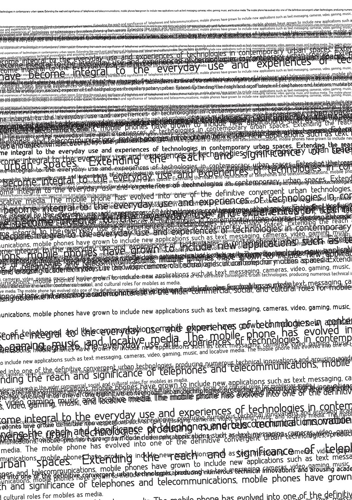
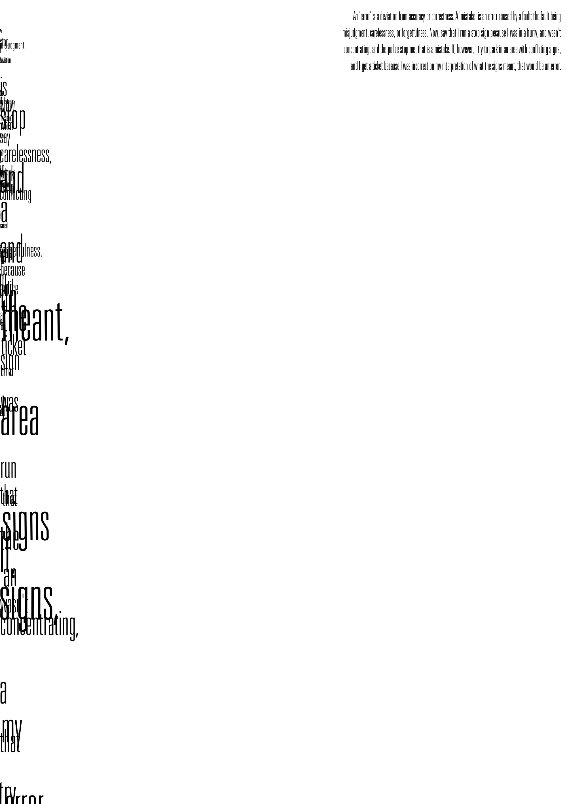
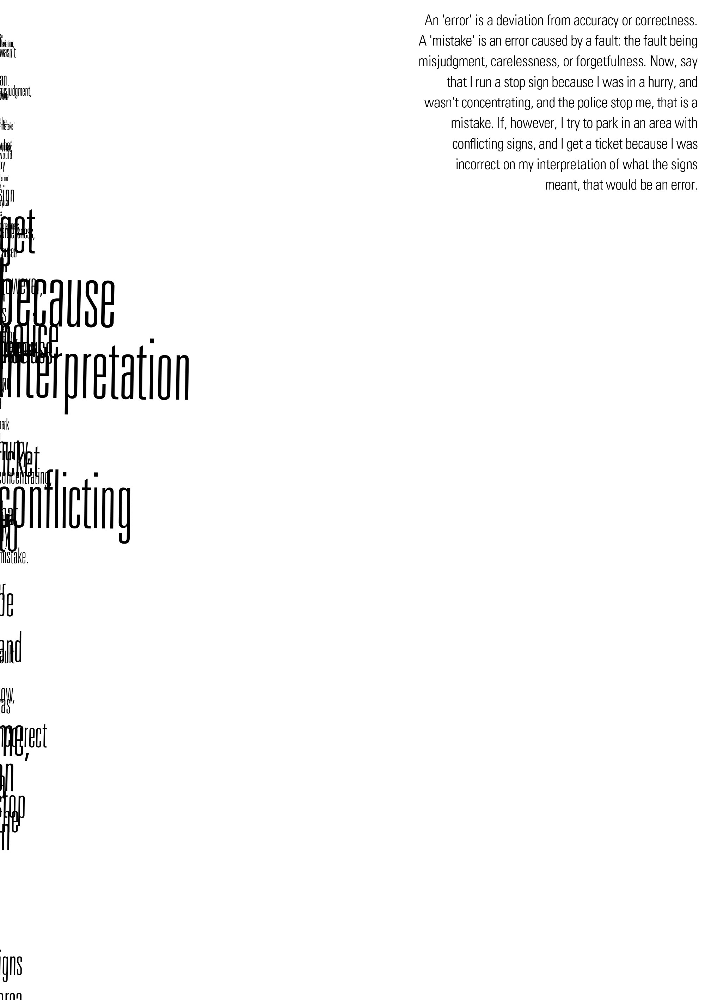
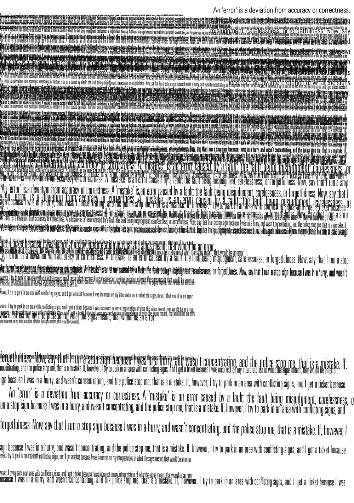

During the periodic hard-drive cleaning, I've stumbled upon a tiny project dated back to 2007. 

It is a python script (most probably a NodeBox script) that produces a generative typography artwork. 

It's more an exploration than a real project but I'd like to keep in memory somewhere for posterity.

Here some samples:

<div class="grid four">
<div class="grid_item"></div>
<div class="grid_item"></div>
<div class="grid_item"></div>
<div class="grid_item"></div>
</div>

and here the full script:

```python
size(480, 680)
background(1)

myString="An 'error' is a deviation from accuracy or correctness. A 'mistake' is an error caused by a fault: the fault being misjudgment, carelessness, or forgetfulness. Now, say that I run a stop sign because I was in a hurry, and wasn't concentrating, and the police stop me, that is a mistake. If, however, I try to park in an area with conflicting signs, and I get a ticket because I was incorrect on my interpretation of what the signs meant, that would be an error."

font("UniversLTStd-LightCn")

push()
fill(0)
fontsize(10)
align(RIGHT)
text(myString, 275, 20, width=200)
pop()

align(JUSTIFY)
font("UniversLTStd-ThinUltraCn")

list = myString.split(" ")

c=0

for i in list:
    c+=1
    fill(0)
    #rect(0, random(5, 30), 480, 10)
    rotate(-.2+random(.4))
    lineheight(random(5, 30))
    fontsize(random(7, c/4))
    text(myString, 0, 0, width=480)
```


