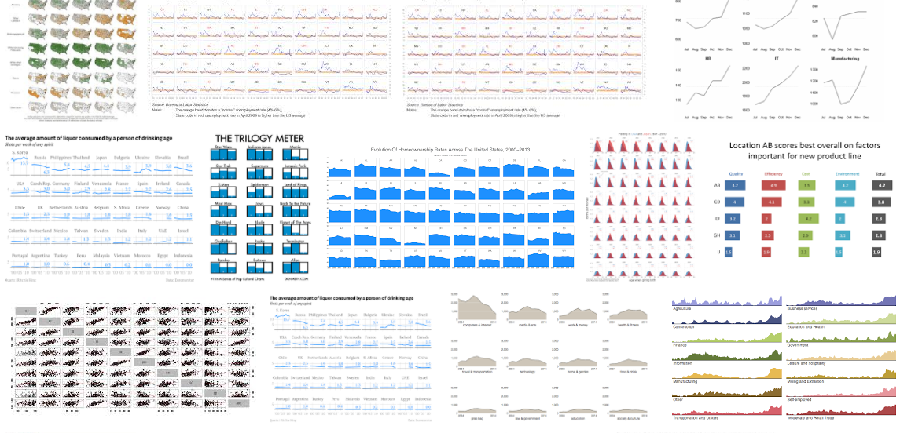
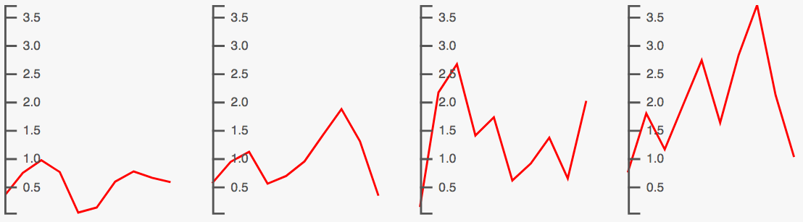
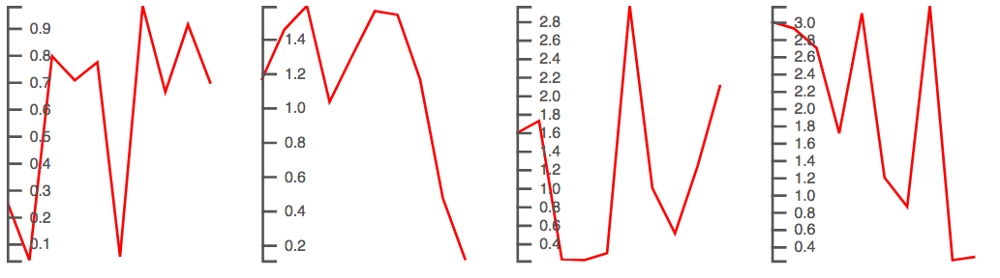

> I like to break the rules sometimes.



[Small multiple](https://en.wikipedia.org/wiki/Small_multiple) in data visualization is a way to represent and compare variations of a property in several categories at once by means of an array of small and pretty similar charts that use the same scale and axes.

The *"same scale and axes"* is mandatory in this context otherwise the comparison cannot be done.

In D3.js context, creating multiple charts out of a single dataset is a matter of using the popular data-join mechanism that is at the heart of the library concept.

Considering a dataset structured as an array of objects with each object that contains an array of data points, a *small multiple* chart like this one:



can be built using D3.js with this working script:

```javascript
var num = 10
var dataset = d3.range(4).map((d, i) => {
	return {key: i, values:d3.range(num).map(c => Math.random()*(i+1))}
})

var groups = d3.select('svg')
	.selectAll('g')
	.data(dataset)
	.enter()
	.append('g')
	.attr('transform', (d, i) => `translate(${i*100} ,0)`)

var mapX = d3.scaleLinear()
	.domain([0, num-1])
	.range([0, 80])

var min = d3.min(dataset, d => d3.min(d.values, c => c))
var max = d3.max(dataset, d => d3.max(d.values, c => c))

var mapY = d3.scaleLinear()
	.domain([max, min])
	.range([0, 100])

var lineGen = d3.line()
	.x((d, i) => mapX(i))
	.y(d => mapY(d))

groups.append('path')
	.attr('d', d => lineGen(d.values))
	.style('fill', 'none')
	.style('stroke', 'red')

var axis = d3.axisRight(mapY)
	.ticks(10)

groups.append('g')
	.classed('ax', true)
	.call(axis)
```

This is the basic in *small multiple* representation: an array of little charts, one property' variation, same scale and axes.

But, one the nice thing working with D3.js is that you can do also silly stuff breaking some conventions just because you can and for fun.  
That's why a few days ago I've questioned myself about how to build a *small multiple* representation with different axes per single chart.

I had to figure out a bit the way to go since, looking the above script, the **.call(axis)** method does pretty all the magic. Instead of using the same scale object and axis object, which is easier, my goal was to compute a different scale (and then a different axis) for each little chart using the data points array of each object.

Basically, this is what I wanted to achieve (remember, no comparison can be done here):



and this is what I've changed in the previous script related to the path generation, basically, I've moved the scale/line configs within the **d** attribute setter:

```javascript
groups.append('path')
	.attr('d', d => {
		var min = d3.min(d.values, d => d)
		var max = d3.max(d.values, d => d)
		
		var mapY = d3.scaleLinear()
			.domain([max, min])
			.range([0, 100])
		
		var lineGen = d3.line()
			.x((d, i) => mapX(i))
			.y(d => mapY(d))
		
		return lineGen(d.values)
	})
```

and the part related to the axis, again, I've moved the configs within the **.each** function in order to initialise an ad-hoc axis object ready to be called at the end of the statement:

```javascript
groups.append('g')
	.classed('ax', true)
	.each(function(d, i){
		
		var min = d3.min(d.values, d => d)
		var max = d3.max(d.values, d => d)
		
		var mapY = d3.scaleLinear()
			.domain([max, min])
			.range([0, 100])
		
		var axis = d3.axisRight(mapY)
			.ticks(10)

		d3.select(this)
			.call(axis)
	})
```

That's sound silly, uh? 

> More **twisted** code to achieve something that is basically **wrong** from the design perspective. 

The reward is the learning benefit out of this.  
I really do not know whether I'll use this little technique in the near future, but I'm happy to be able to handle it.  
That is the very good part about working with a library like D3.js that gives you the power to break the rules somethimes.

Happy coding! 