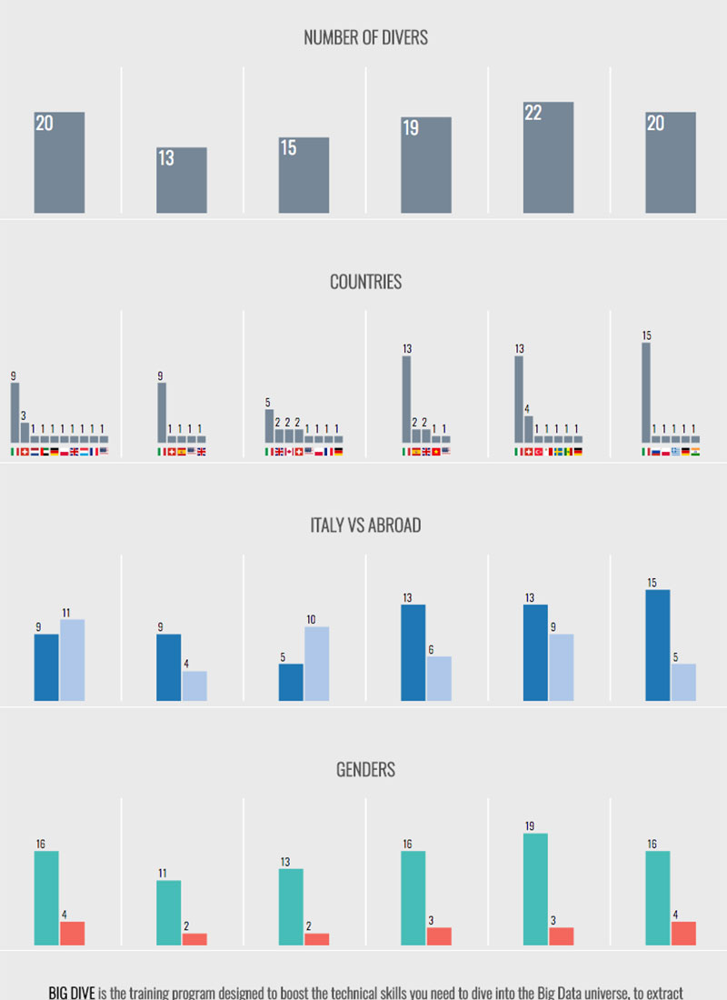

[Big Dive 6](http://www.bigdive.eu/), the training program to learn the skills to dive into Big Data, **is over**. You can read a brief story [here](https://medium.com/topixlab/big-dive-6-in-a-story-796b784f84da).

This year we've chosen to collect  the participant's information in order to create a small visualisation, an interactive report to have a glimpse of the course through a different angle. I've been in charge to design and develop the visualization with great freedom (thanks to its [organizers](https://www.top-ix.org/it/home/)).  
I have to say it, I had a good time building it.

## The Process

As usual, the final outcome doesn't look like the initial idea. The design process leads to different paths and the following design choices are quite difficult to outline at the beginning. That's the beauty of the design: you kick-off an idea; you follow a process; you end up with something different.

To give a glimpse of what I'm talking about, here a bunch of screenshots I saved during some checkpoint of the process.

The initial iterations are usually the most divergent. It's the time to discover the path:

This second round shows an established path with the beginning of the fine-tuning phase:

The last iterations show how many little changes can be done. To be fair, I'd go forever, there's no limit to perfection:

This is why is so important to stop at some point and ship it.

## Conclusion

Is it over? I don't think so. I suspect I'll consider some updates for the next edition of [Big Dive](http://www.bigdive.eu/). 

Now you can [experience](http://viz.bigdive.eu/) the visualization.  
Source code available [here](https://github.com/abusedmedia/BigDive-Viz).