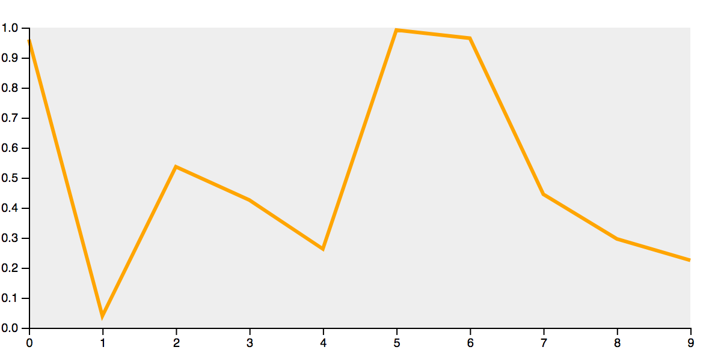

In the last article, I've started the initial proof-of-concept regarding building reusable D3.js components. I've ended up to an empty boilerplate following the suggestions provided by Mike Bostock in his [Towards Reusable Charts](https://bost.ocks.org/mike/chart/) article.

I've spent a bit of time trying to use these principles in a real-world component, for instance, a basic line chart. Most of the initial ideas were preserved while some other have not.

I've abandoned the generic public method **config()** to override public properties preferring a more explicit *method per property* to edit every single public setting.

Basically, instead of:

```javascript
vis.config({width:300, height:300})
```

now it should be something more D3-way like:

```javascript
vis.width(300)
	.height(300)
```

using the implementation of a setter/getter such as:

```javascript
build.width = function (value) {
	if (!arguments.length) return width
	width = value
	return build
}
```

This way each public config is also a getter method:

```javascript
var h = vis.height()
```

A padding object has been added to calculate the useful area for the chart that is always required: 

```javascript
var padding = {top: 25, bottom: 25, left: 25, right: 25}
...
// useful area
var innerw = width - padding.left - padding.right
var innerh = height - padding.top - padding.bottom
```

## A working example

I'm quite happy of the implementation so far and here the result of the component using the following initialising code:

```html
<svg width="600" height="300"></svg>
<script>
var vis = myViz().width(400).height(400)
var dataset = d3.range(10).map(d => Math.random())
var svg = d3.select('svg')
	.datum(dataset)
	.call(vis)
</script>
```



As you might notice yourself, this template contains both the **Scale** and the **Axis** configurations as well. I'm not totally sure whether it is ok or not.  
Scales and axis usually need to be configured according to the nature of the dataset but in this template there are some assumptions about them, that is why my doubts.

I don't want to take any structural decision right now. It'd be too soon. I'm going to continue to evolve this proof-of-concept by means of further real-world components, eventually finding the right solution (hopefully).

You can check the complete source code at this stage [here](https://github.com/fabiofranchino/towards-a-better-chart-template).