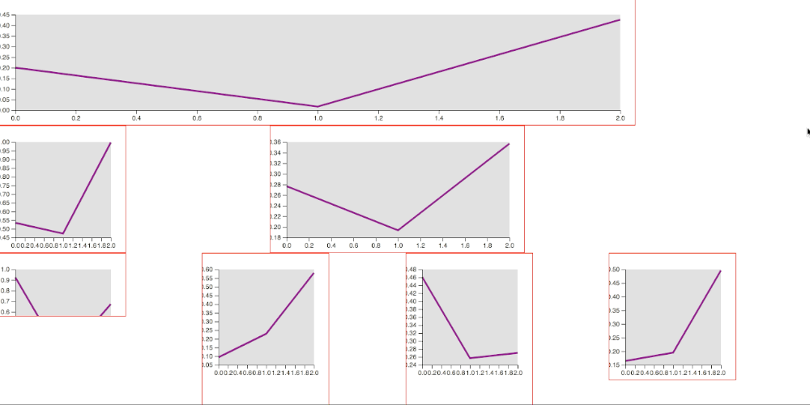
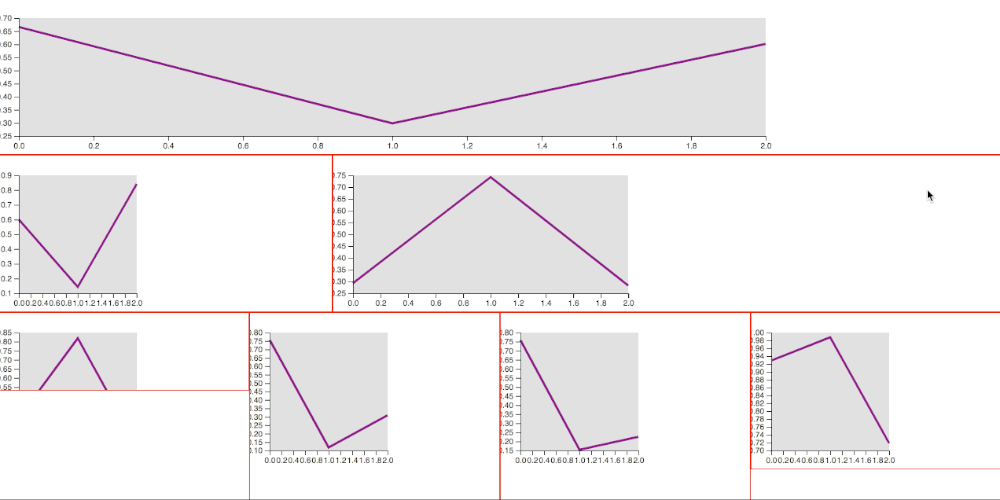
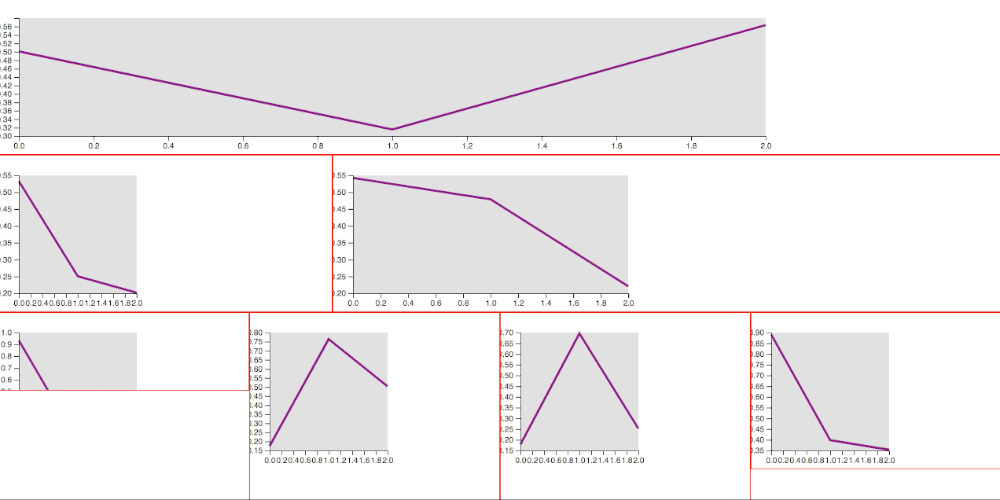
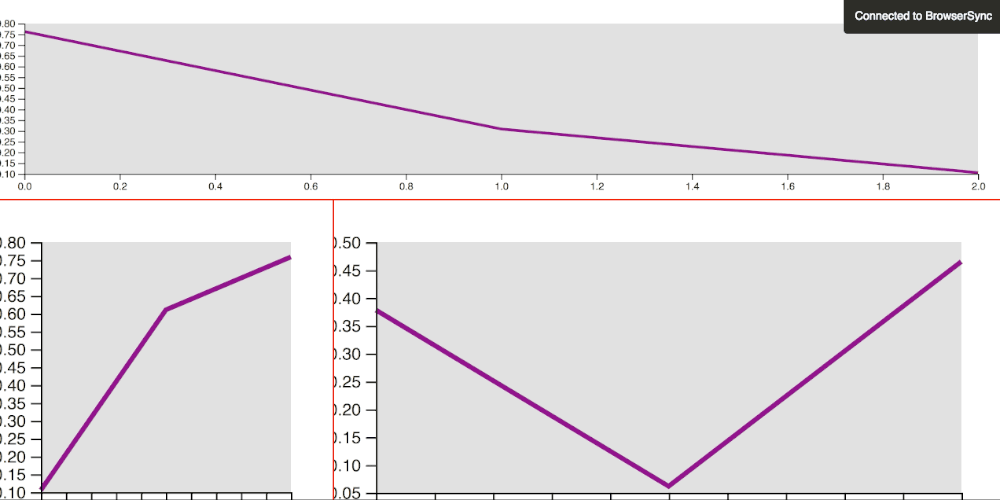
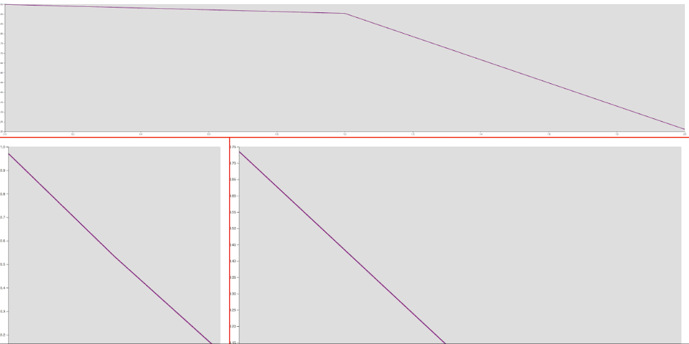
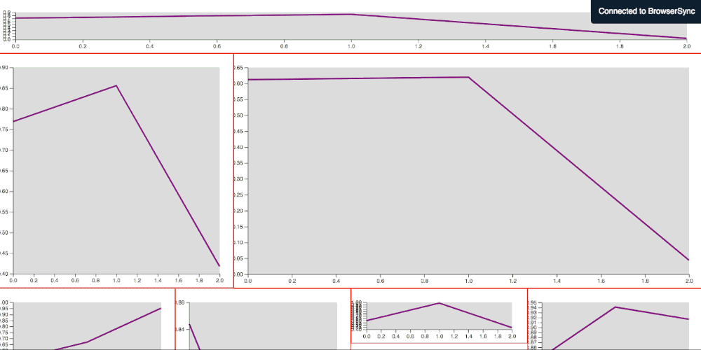

Following the [initial exploration](http://fabiofranchino.com/blog/towards-a-better-chart-template/) on design and build a reusable D3.js chart, some questions arose about having multiple components on the same page and how they can play nicely together.

The browser is pretty smart at computing layout these days, therefore, I wanted to exploit it as much as possible instead implementing some logic in order to place and resize element on a given canvas.

I've conducted a quick test about how to use CSS, Flexbox and SVG element alongside my initial [chart template](http://fabiofranchino.com/blog/towards-a-better-chart-template/) in order to get a fluid container responsible to resize all the components.

## Using the width and height

The first attempt was obvious. Given a quick Flexbox layout, I've put a bunch of SVG tag with proper size dimensions set, such as the following markup:

```html
<div class="row">
  <div class="one">
    <svg width="1000" height="200"></svg>
  </div>
</div>

<div class="row">
  <div class="one">
    <svg width="200" height="200"></svg>
  </div>
  <div class="two">
    <svg width="400" height="200"></svg>
  </div>
</div>
```

They are all consistent between them but the overall page layout doesn't work:



## Using width:100%

Using the same markup but assigning to all the SVG tags the *width:100%* via CSS can help a bit but with other issues to solve:



## Adding the viewBox

Adding to each SVG tag a proper viewBox attribute:

```html
<div class="row">
  <div class="one">
    <svg width="1000" height="200" viewBox="0 0 1000 200"></svg>
  </div>
</div>
```

It does mitigate the above issues, still not perfect in some conditions, though:



## Removing the width and height

Removing the width/height attributes from the SVG markup leaving only the viewBox seems to solve most of the issues. Now all the components fit the available space, preserving the aspect-ratio of each one. There's still some issue here: all the component' elements get resized in a different way, thus the overall consistency get lost (look at the size of the axis or the padding of each chart). Another problem is the exaggerated size of some elements in some situation (font-size too big of too small) because the SVG get resized proportionally no matter the window size:



## Compute the viewBox according to the window size

Since the different sizes of the chart elements were caused by the different viewBox present on the same page, I've tried to re-compute it based on the window size. This technique solved some issues but still, it does remain difficult to set them properly without spending a lot of time making this calculation precise, not to mention that any layout change does invalidate all the mentioned setting.

This is the code to re-calculate the viewBox. I've used a custom HTML attribute, *ratio*, to keep the reference of the desired aspect-ration of each SVG element:

```html
<div class="row">
  <div class="one">
    <svg ratio="5 1"></svg>
  </div>
</div>
```

where **ratio="5 1"** means that width should be five times more that height, and here the code to read the ratio to compute the viewBox on each widow resize event:

```javascript
d3.select(window).on('resize', () => {
  onResize()
}).dispatch('resize')

function onResize(){
  var multiplier = window.innerWidth / 2 // arbitrary calculation here
  d3.selectAll('svg').each(function() {
    var wh = d3.select(this).attr('ratio').split(' ')
    var w = parseInt(wh[0] * multiplier)
    var h = parseInt(wh[1] * multiplier)
    d3.select(this).attr('viewBox', '0 0 ' + w + ' ' + h)
  })
  svg.each(function() {
    var wh = d3.select(this).attr('viewBox').split(' ')
    var w = wh[2]
    var h = wh[3]
    d3.select(this).call(vis.width(w).height(h))
  })
}
```

Here you can see the internal elements size are constant (font-size, padding) no matter the size of the SVG tag. The proportions are preserved. Still, it's difficult to have a consistent element size across different components (same font-size and padding between different SVG charts):



## Finally, the solution

The working solution has been to use the ratio together with the width of the computed wrapper that contains the SVG tag. This way we are able to calculate a proper viewBox for each SVG tag according to the given ratio without having to do hard math in order to have consistency across different components and, most importantly, it works out of the box:



The new markup changed a bit:

```html
<div class="row">
  <div class="one">
    <svg fit ratio="5 1"></svg>
  </div>
</div>
```

and here the script that will make all the calculation automatically:

```javascript
d3.select(window).on('resize', () => {
  onResize()
}).dispatch('resize')

function onResize(){
  d3.selectAll('[fit]').each(function() {
    var ratio = d3.select(this).attr('ratio')
    var factor = (ratio) ? (ratio.split(' ')[1] / ratio.split(' ')[0]) : 1
    var computedW = parseInt(window.getComputedStyle(this).width.split('px')[0])
    var attrH = d3.select(this).attr('height')
    var calcH = (attrH) ? attrH : parseInt( computedW * factor )
    d3.select(this)
      .attr('viewBox', '0 0 ' + parseInt(computedW) + ' ' + parseInt(calcH))
      .call(vis.width(computedW).height(calcH))
  }) 
}
```

## Bonus track

What about having a component that resizes well only on one direction (let's say the width) while keeping the height with some fixed specific value?

By setting the attribute height instead the ratio, we can accomplish such functionality quite easily:

```html
<div class="row">
  <div class="one">
    <svg fit height="100"></svg>
  </div>
</div>
```

This feature can be seen in the last screencast, the first component actually preserves a fixed height.

As usual, the full source code of this exploration can be found on [this repo](https://github.com/fabiofranchino/size-matter).

Happy coding!