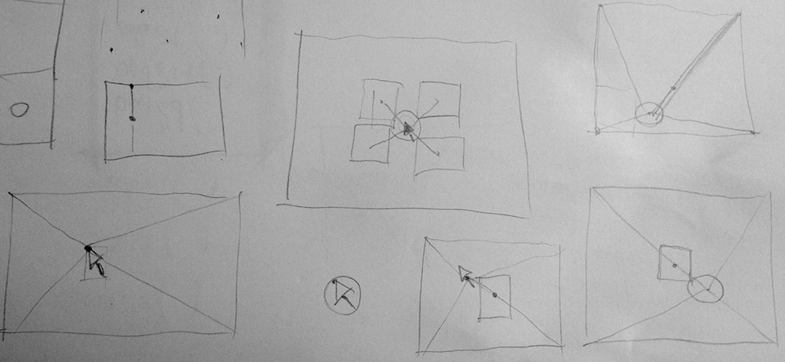
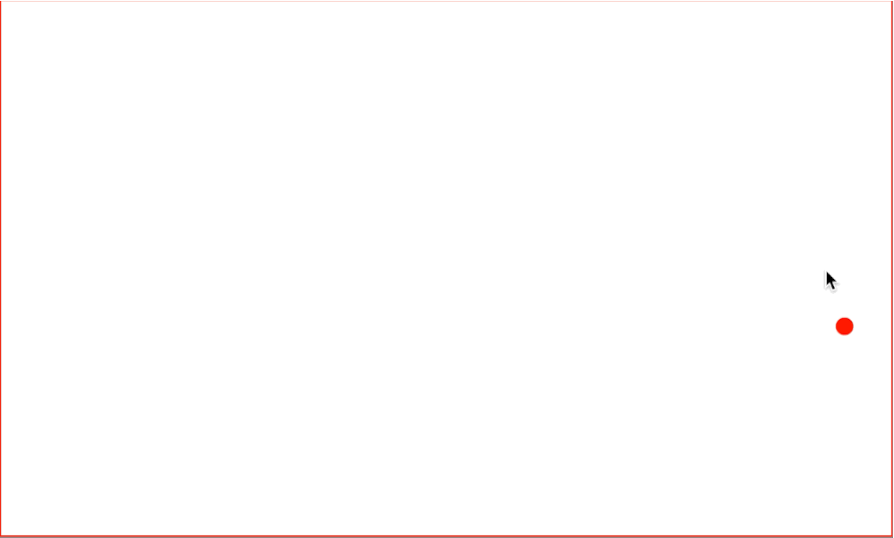

I was just scribbling on paper without a specific goal. Suddenly, a little **ah-ha** moment brought me in a little exploration. 



## The proof-of-concept

Apparently, I'm all about [Proof](http://fabiofranchino.com/blog/going-towards-reusable-d3js-charts/)-[Of](http://fabiofranchino.com/blog/towards-a-better-chart-template/)-[Concept](http://fabiofranchino.com/blog/size-matters/) these days. 

This time is about positioning a graphic element (let's say, a tooltip) next to the mouse but using the most efficient area in a given canvas in order to avoid the element to be cut by the boundary of the canvas.

## Disclaimer

I didn't make any research on the topic, I bet I wouldn't be astonished if there were, at least, a couple of Ph.D. out there on efficient tooltips positioning algorithms.  
I don't know whether this technique has been already used somewhere. In this case, I would love to hear more about them.

## The rules

They are simple and can be outlined as the following:

- construct four lines between the canvas edge corners and the mouse position
- find the longest one
- find a point along the longest line that is far enough from the mouse
- use that position to move the centroid of the element we want to position efficiently

A very efficient way to show how it works and what's going on behind the scene might be this progressive visualization:



Here the relevant javascript code that uses a couple of essential native functions to accomplish this feature. It was extrapolated by a D3.js script but it can be adapted to other contexts quite easily. This script requires to be within a **mousemove** listener:

```javascript
// finding the longest line
var maxL
var maxV = 0
lines.each(function (d, i) {
  if (d.l >= maxV) {
    maxL = this
    maxV = d.l
  }
})

// get the final point
var l = maxL.getTotalLength()
var p = maxL.getPointAtLength(l - 60)

// position the element
legend.attr('transform', `translate(${p.x}, ${p.y})`)
```

Here the interactive version (click to toggle the chart visibility):

<iframe class="fuildframe" width="3000" data-width-mobile="1000" height="1000" src="https://fabiofranchino.com/efficient-element-positioning/" frameborder="0" scrolling="no"></iframe>

## Conclusion

I don't know whether I'm going to use this technique in the future. Nevertheless, it's always good to figure out what's going on behind the curtain, it can't hurt.