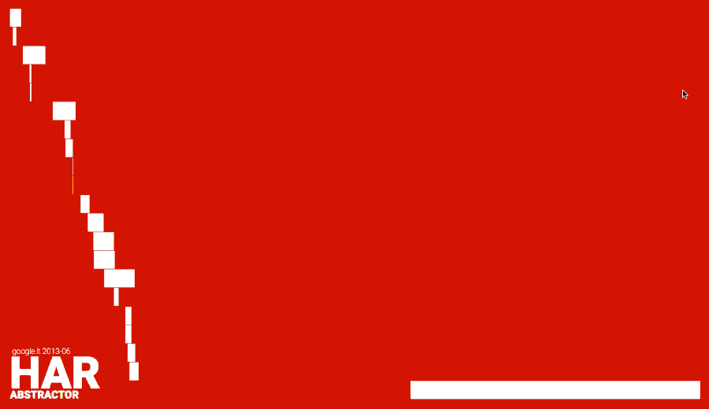
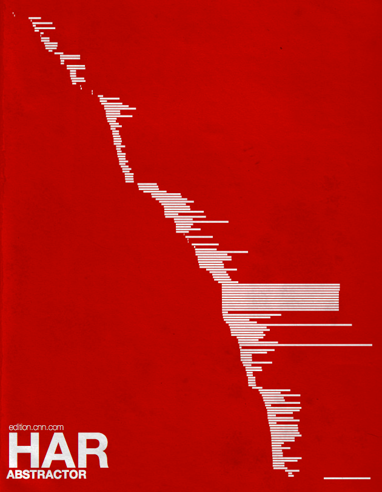
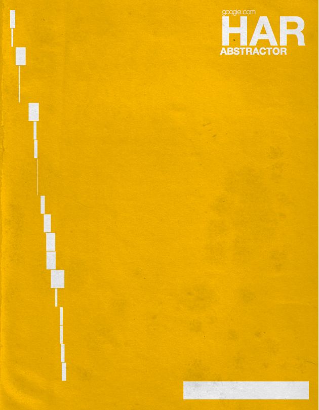
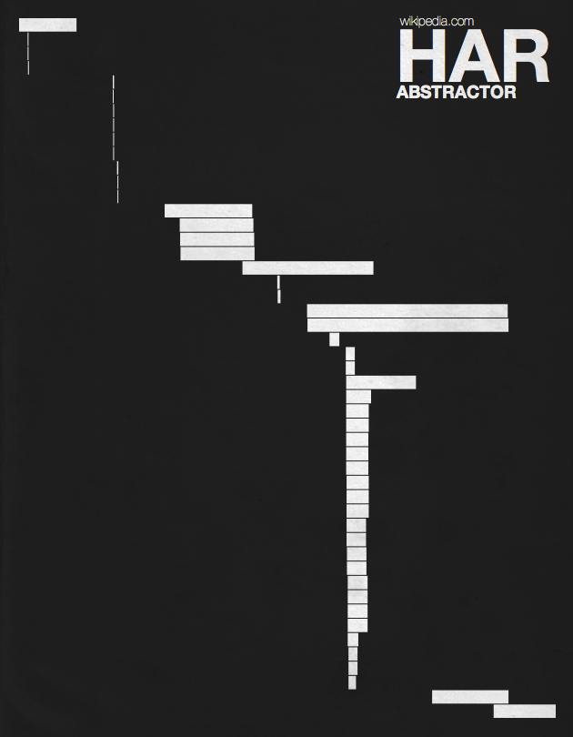

Back in 2013, I made a little visualization project using [HAR](https://en.wikipedia.org/wiki/.har) as data source.

The purpose was about experimenting with graphic art using some data as input material. At that time I liked the idea to use a kind of fingerprint for web pages in order to build some retro-style graphic compositions.

These are some saved images related to popular home pages: 

Here the working D3.js script (click to loop through different data sources):

<iframe class="fuildframe" width="3000" data-width-mobile="2000" height="2000" src="https://fabiofranchino.com/har-abstractor/index.html" frameborder="0" scrolling="no"></iframe>

You can experience it in full window [here](http://fabiofranchino.com/har-abstractor/). and you can find the source code [here](https://github.com/fabiofranchino/har-abstractor).