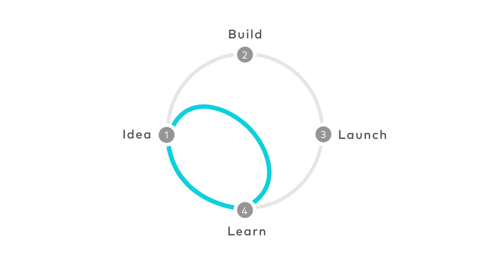

I've been interested in the [Google Design Sprint](http://www.gv.com/sprint/) method over the last year.  
I've conducted, successfully, some sprints in our studio, so far. I'm quite happy with the results even though a degree of personalization is required.

But, what is a Design Sprint?

> The Google Design Sprint is a loosely based Agile method to design and validate quickly a business idea.

It's a structured process with a tight deadline and a fixed and well-encoded time-frame.
Everything has to happen in a full working week, five full-time days.
The team should be composed of a maximum of 6-8 persons and it should be diverse and multidisciplinary because different skills are required in order to cover all the tasks the sprint requires.

According to its proponents, it is an **efficient** and **affordable** way to *validate* a product or service idea before going to invest big money on implementation.

Here a brief outline of the sprint week, one phase per day:

## Understanding

It's the day where the team gets the brief and the context of the project in order to set the mind on the proper track.
It's mostly based on talk and people interactions about **content and purpose strategy**.
One of the tools that can be used to foster design thinking is the **HMW** (acronym of How Might We) tool to encode every design opportunities into questions in order to ease the collecting and choice activity. A key person to lead the process is mandatory.

## Ideas

In this day it's all about sketching ideas with a precise schedule of activities, personal and team wise, with review and discussions. It's the **diverging** day where all the crazy ideas can be put on the table.

## Decision

In this day all the good ideas outlined and discussed the day before need to be condensed into a single one which will be the main path to follow in the next phases.
Everyone **votes** each single good idea and a new project draft will be outlined by the whole team. 
The new project idea has to be storyboarded within the end of the day.

## Prototype

Based on the detailed sketch of the final idea the team has to prototype it in some realistic form in order to be able to test it with real people.
The tools can be anything as long as they allow to achieve a working artifact useful to test and validate the relevant functions, planned for the next day.

## Test

The last day is dedicated to testing the prototype with real people.
This means you need to find people who are willing to give a bit of their time to you. This is why you need to give them something back as a gift.
The test is a mix of interviews and observation method and should follow this process:

- welcome and introduction to this activity
- a brief talk to break the ice asking something personal and easy to the user (your working day, your hobbies, etc)
- introduction to the project and the prototype and how you are going to assist him/her
- use the prototype by means of specific tasks outlined ahead
- little debrief, opinions and considerations, then a big **thank you** alongside the gift

## Conclusion

As in every strategy, there's something good to take away and something that needs to be changed. The **Design Sprint** from Google is no exception.

The good part is the focus of the process, that need to be conducted without external distraction. Also, the idea to put together different people in order to create a diverse team is a very useful approach.

I wouldn't be strict about the details (the crazy eight, the HMW, the voting system, etc) since it really depends on the project.

Based on my experience managing few sprints so far, the most important thing is about to book a focussed time frame with a diverse team. The schedule of the Design Sprint is a good starting point but you don't have to adhere strictly. It's much better to follow the path the team is drafting over time because if it happens it means it's required and it's good for the final outcome.