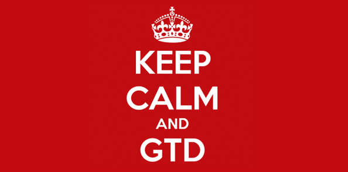

Everybody, at some point in time, will stumble upon the [GTD](https://en.wikipedia.org/wiki/Getting_Things_Done) issue. 

**Getting Things Done** is the art of keeping organized and efficient the list of tasks we've been asking to accomplish in our everyday life, both personal and professional as well.

In theory, it's straightforward.  
The process of *capture*, *clarify*, *organize*, *reflect* and *engage*, resonates right to me.

*Capture* is something given these days. The tools we regularly use such as email, chat, pm tools and social networks bring to us the raw information we need to process.

*Clarify* is meant to be the process for each new piece of information that comes up in front of us in order to give it the right place in our brain, based on several properties.

*Organize* is the activity to keep in order our list of tasks considering the new comers and the changes that might occour.

*Reflect* is the frequent review of the organized corpus of tasks in order to quickly update and refine it.

*Engage* is the final action related to what we have to do based on what we have collected, processed and synthesized in the previous phases.

## The real world

The problem is the real world. The amount and the diversity of the daily information are huge and applying that process is far from being easy.

Take the email. How many of you struggle with it? The email is the primary source of that complexity.

> A friend of mine told me the email is like a public to do list, in the sense that everybody can add tasks for you without asking permission for.

## Tools

I see a parallel with the Agile wagon. On one side, few principles easy to grasp that are meant to guide us to handle our life efficiently, on the other side tons of tools, books, experts, workshops that are meant to help us to undestand those principles but that they are far from being efficient.

There is countless number of tools out there that allegedly try to convince us they can solve our day-to-day problems. Eventually, they are all to-do lists. 

Indeed, [thousand](https://www.producthunt.com/search/posts?q=to%20do&all=true) of to-do apps/services are just waiting for us for a test drive. 

Over the years I tried a lot of them, giving up every single time.  

## Single Point Of Truth

I do believe in the Single Point Of Truth ([SSOT](https://en.wikipedia.org/wiki/Single_source_of_truth) theory).  

At some point, I've started to use Evernote for my annotations. At some point, I've ended up to a single note to manage day-to-day tasks, adding, updating and deleting chunks of texts there.

In 2016 I got rid of Evernote using a single .txt file, always open on my computer. 

That file is my single point of truth. It's the place where I can put words/sentences/notes/lists regarding both my personal and professional reminders. I can highlight them with colors, size, font-variance, bullet-list etc; I can give different priorities moving up and down chunks of text. I can quickly annotate over specific sentences whether it needs.  
I religiously edit it every day adding what's new, removing what's obsolete or useless, updating what has been changed.  

So far, this little file is the **best tool** I found out that help me to keep my life organized.  
No muss, no fuss, **it just works**.