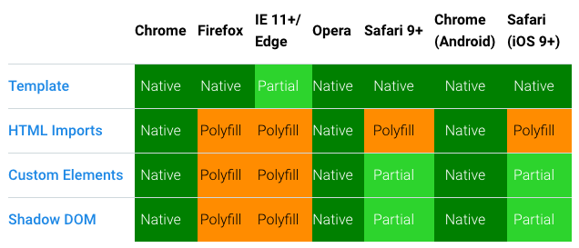

Apparently, *HTML import* is dead. This is what I've learned from [ShopTalkShow](http://shoptalkshow.com/episodes/279-rip-html-imports/) today.

I've always been confident and happy about it because it has always been the promise to solve so many struggles in front-end development.

I was wrong. It's not going to be a thing.

The browser support speaks by itself. Only Google Chrome natively support it. The other main vendors need a polyfill to work with.

This will affect also the [Polymer Project](https://www.polymer-project.org/), no doubt.

## We need modularization

Modularization is the (only) way to survive in the complexity of the front end development world.

I got that years ago, this is why I've built something to overcome this necessity [here](https://www.npmjs.com/package/static-player) and [here](https://www.npmjs.com/package/grunt-static-player).

Right now, I see in the .vue [single-file-component](https://vuejs.org/v2/guide/single-file-components.html) mechanism the best scenario and this is why [I'm](/blog/vuejs-nice-to-meet-you/) [so excited](/blog/vuejs-welcome-cli/) [about](/nuxt-getting-started-with-it/). I know, it's not standard but I hope to see similar (or better) strategies by the W3C in the near future.

In the meantime, give me the time polishing my next **Vue.js** exploration.