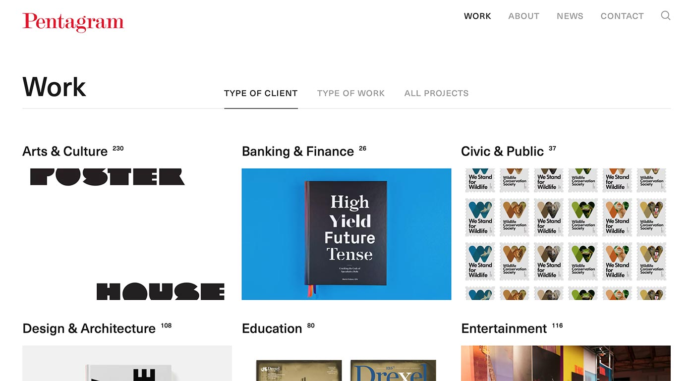

This post opens a new kind of content in this blog.

Beside my technologist interests, I'm a designer, therefore, I do care about design choices.

Everything related to how a specific interface has been designed and built is something within my interest boundaries.

There are a lot of projects out there very well executed. I want to highlight some of them alongside the details that resonate right to me.

In this *hello world* post type I want to show a specific choice taken on the [Pentagram](https://www.pentagram.com/) website.

**Pentagram** doesn't need to be introduced. They recently renewed their website. It's a sleek and very well crafted website that provides everything you might expect from a design agency website.

Communicating to the outside world for a design and communication firm is one of the most difficult and challenging task ever. The diversity of the outcomes and the required skills of a typical design studio makes very hard to select and define what communicate and show considering the average time and commitment a user is willing to give.

One of the most common ways to explain to potential users what an agency is able to provide is by showing their projects. I understand the rationale: demonstrating the abilities and skills through finished projects in order to attract potential commitments.

[Pentagram work section](https://www.pentagram.com/work) shows something interesting and a little bit different than the usual way. The primary entry point to explore projects is by **Type of Client**. This might seems nothing special but, to me, that choice rang something.

Showing projects basically mean considering users as potential clients **that are looking for something** (a brand redesign, a new website, a social campaign). Therefore, trying to show the best objects the firm is able to craft sounds right, in the hope to attract future contracts.

But showing the *type of client* as the entry point to engage potential customers means they're considering users as potential clients **that are looking for help** by means of a comparison with other similar previous clients needs and solutions.

I'm not saying that this technique is totally right nor that is something original. What is right to me is the way Pentagram consider their users, someone that is looking for consultancy, not outcomes or finished projects.

This leads me to think that showing projects as an entry point maybe is the wrong choice if the goal is to attract potential customers. It might be the right choice if the goal would be to impress other similar agencies/professionals.

Of course, Pentagram can afford this kind of structure thanks to their portfolio which is vast and diverse. I really don't know whether other agency might be effective like them with a smaller portfolio.

I don't have any data to support whether this solution is working or not, we might ask to Pentagram :). Nevertheless, I'm quite sure they've conducted some *user research* to support their choice.

