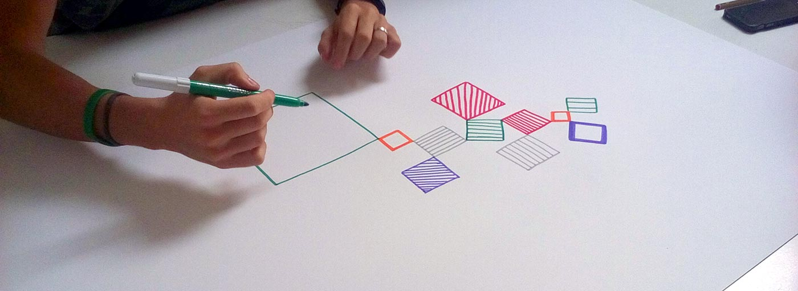
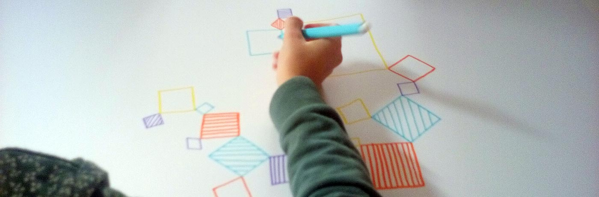
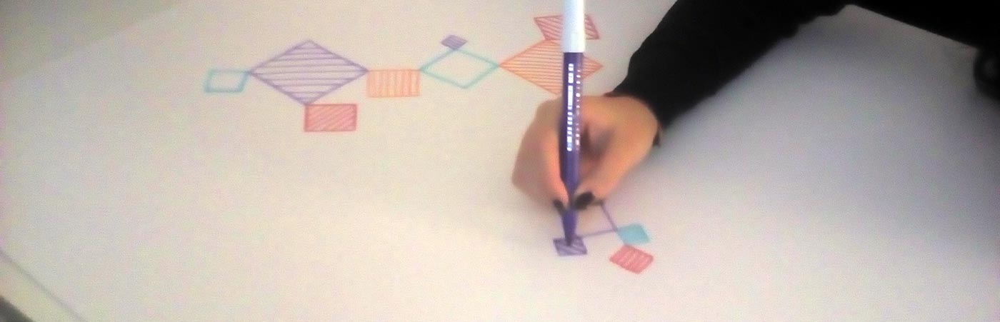

So happy since I've successfully conducted my first [conditional design workshop](https://conditionaldesign.org/) with my students at IED Torino.

It's been so long since I had this desire and finally I caught the opportunity with my new class of wannabe designers.

I've given 30 minutes for the activity. I've set up 7 groups,  4/5 people each.

They had to draw a little square, turning clockwise, on an A0 sheet, with a colored marker, each square has to follow these rules:

- it doesn't be too much big/small
- it needs to have a vertex connected with another square' vertex
- it can be rotated by multiples of 45°
- it can be filled with parallel lines, horizontal, vertical or diagonal
- it doesn't have to intersect any other shapes

I'm quite happy with the outcomes. They were skeptical at first but during the session, they got engaged and I had some difficulties to stop them because the time run out.

I've noticed a couple of things observing them during the workshop:

- They started to draw in silence but then they began to **talk** and **interact** in order to suggest possible directions (where to draw the next square, how to draw it, etc)
- They followed the rules strictly at first, then some **asked for variations** and some were nice, which I will include in future editions.
- They began even to want to **break** some rules. Some were interesting starting points for further explorations.

Eventually, they **loved** their creation as it happens for a creative team after a well designed project.