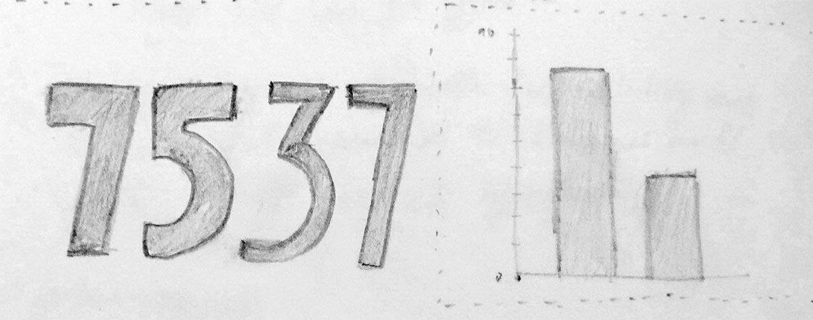

I'm a fan of the [45 ways to communicate two quantities by Santiago Ortiz](https://visual.ly/blog/45-ways-to-communicate-two-quantities/). I use it in any DataViz introductory lessons I give.

In my recent full-day workshop on DataViz and d3.js at [Domus Academy' Master in Interaction Design](http://www.landing.domusacademy.com/master-programs/interaction-design/), I've caught the opportunity to test my students with a simple in-class activity borrowing the Ortiz's challenge. 

I've ended up believing that I should always spend half an hour with this exercise in future DataViz classes because it provides (teach) them an interesting perspective on some core principles related to data visualization and visual perception.

Here some results:

