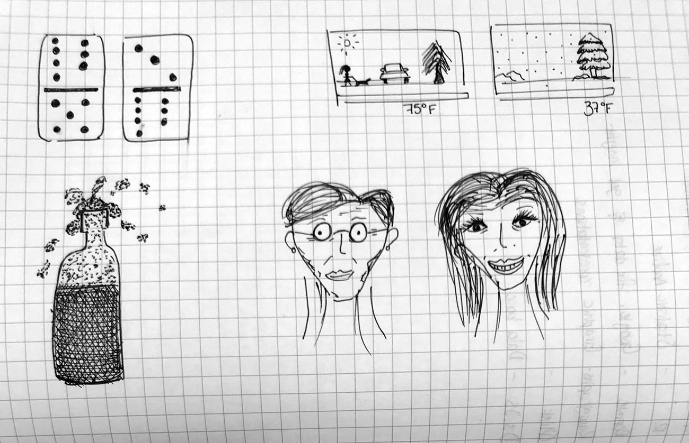
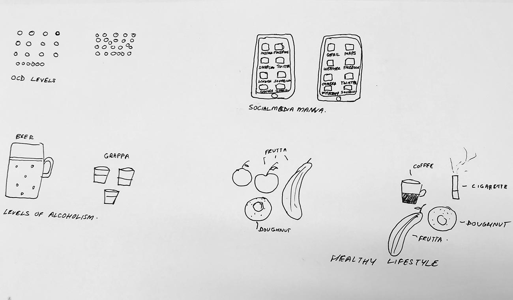
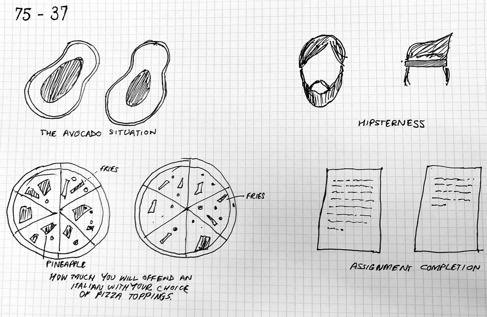
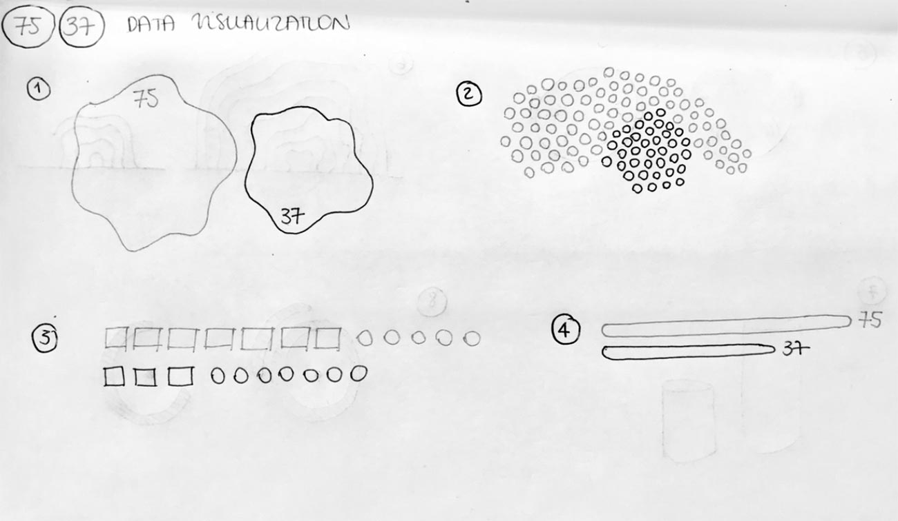
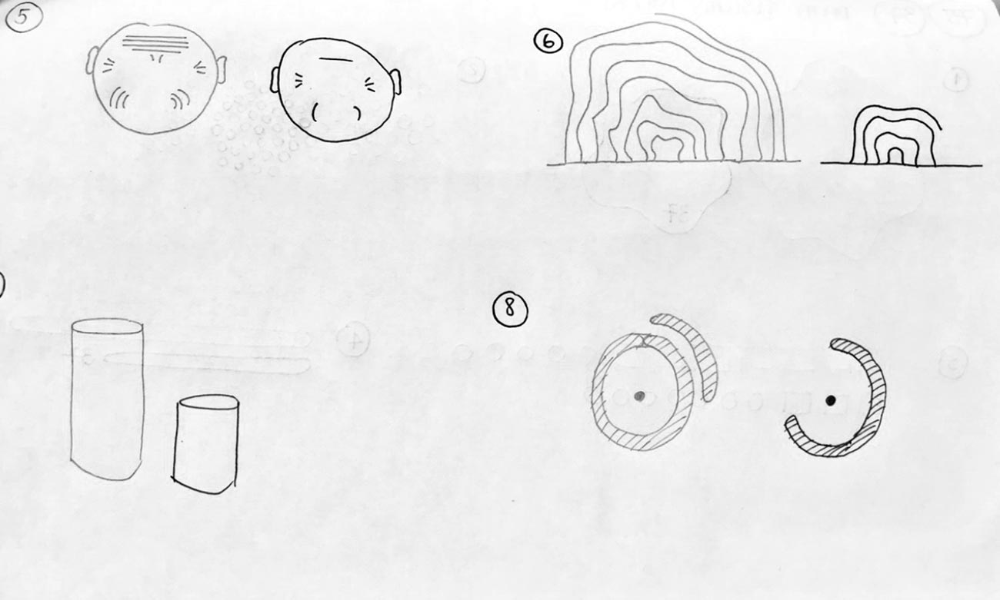
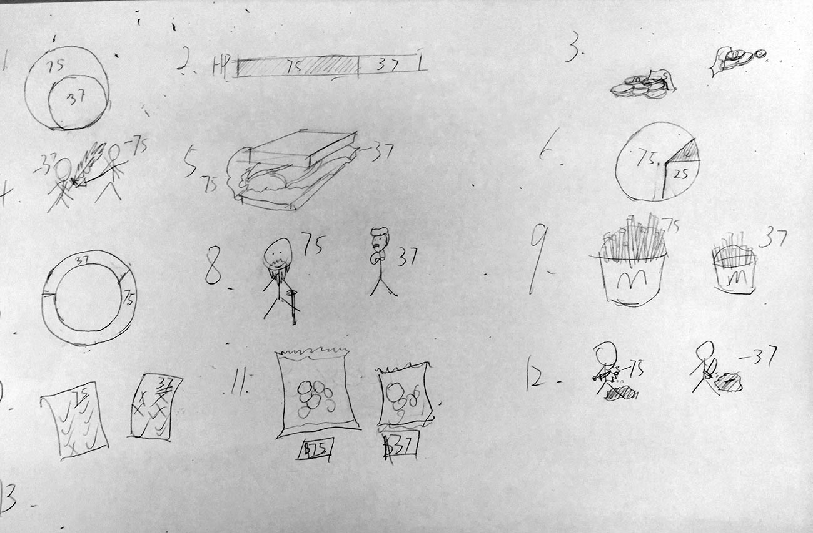
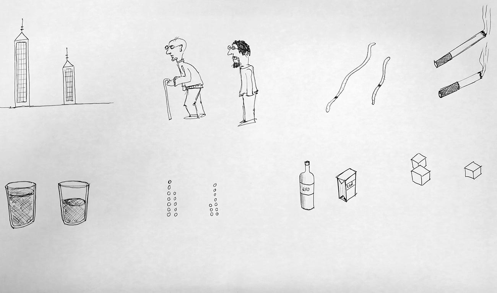
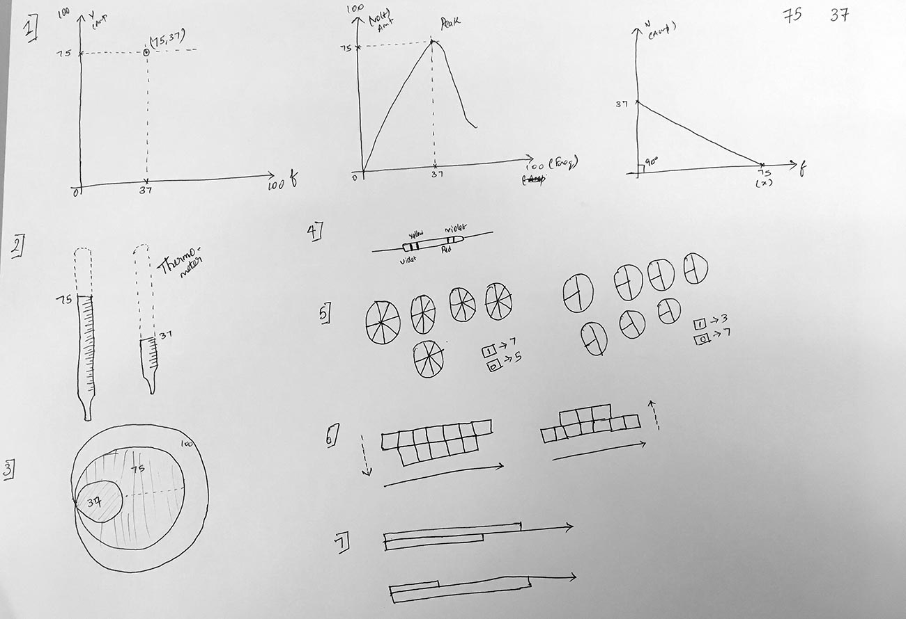

I did it [again](/blog/sketching-7537-at-domus/). 

The 75/37 sketching exercise to get a grasp of one of the core activity when doing data visualization.

This time with my new class at the [Supsi Master in Interaction Design](https://www.maind.supsi.ch/).

It's nice to see how people interpret this exercise with very diverse outcomes.

And I really love the 'offending pizza for italian' sketch, though!

Here a selection of the results:

