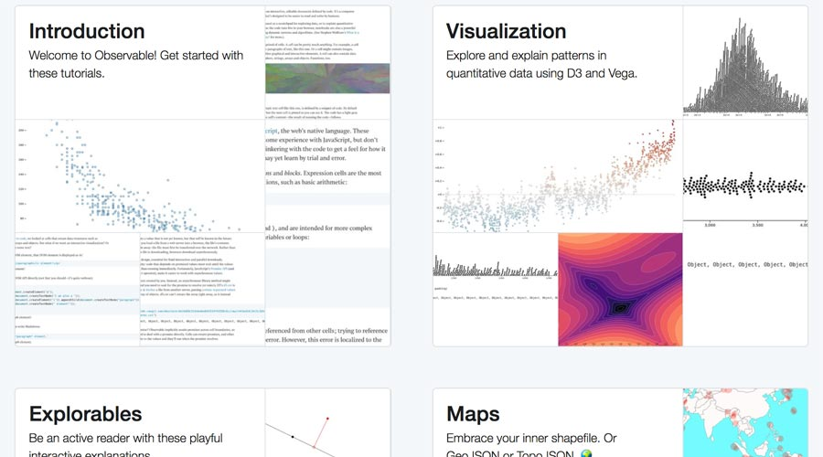

I've already shown multiple times [my excitement](https://fabiofranchino.com/blog/runkit-is-great/) for Runkit.

For that reason, I'm furthermore excited for the recent announcement of another incredible online tool: [Observable](https://beta.observablehq.com/).

Both tools overlap a bit but it looks like Observable try to push further.  
Indeed, it is already incredible even considering its inception. It's an online code editor that allows **reactive programming** to foster discoverability and effective communication where data exploration/visualization can find the most natural place to live.

It's in beta but the examples that can be explored are bold.

Can't wait to test it out and, most importantly, use it in some project.

