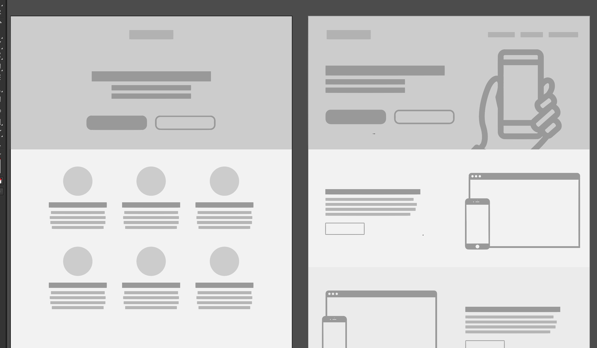
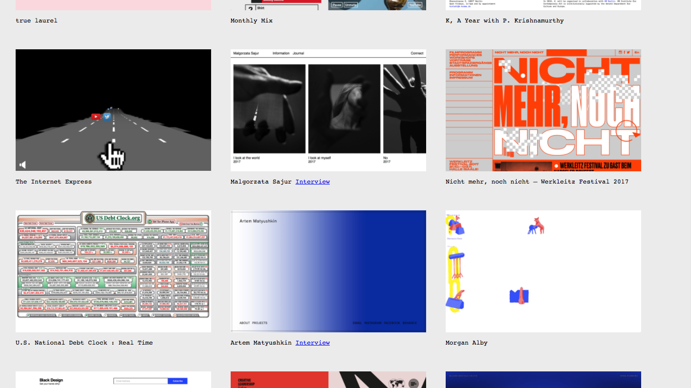
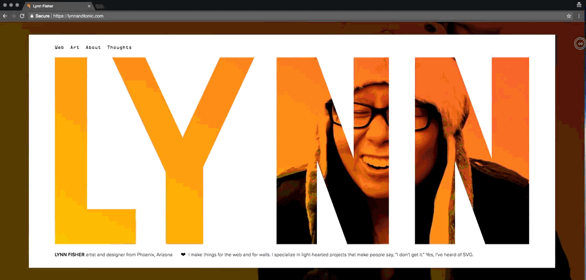

Every web design savvy knows this joke: **which one of the two possible websites are you currently designing?**

Aside from the funny thing, this is an **issue** in creativity. Apparently, there's no room for further exploration. Did we reach the perfection or the enlightenment? I hope not!

Thank god, there's [hope](http://brutalistwebsites.com/):

It does rely on a very interesting bottom-up and well-known movement called [Brutalist](https://en.wikipedia.org/wiki/Brutalist_architecture) the web design community started to become part of a while ago.

Here's the lovely brief manifesto:

> In its ruggedness and lack of concern to look comfortable or easy, Brutalism can be seen as a reaction by a younger generation to the lightness, optimism, and frivolity of today's web design.

Please don't be superficial. What it seems just gym for young kids it might be a seed for new aesthetics. 

Creative and design studios started to embrace it as a means of exploration such as [HawRaf](http://hawraf.com/) but one of the boldest examples of new possibilities that might arise is without any doubt the home page of the designer [Lynn Fisher](https://lynnandtonic.com/):

How to use the media query, a CSS function to manage the responsiveness of a website, in a creative and novel way. Chapeau!