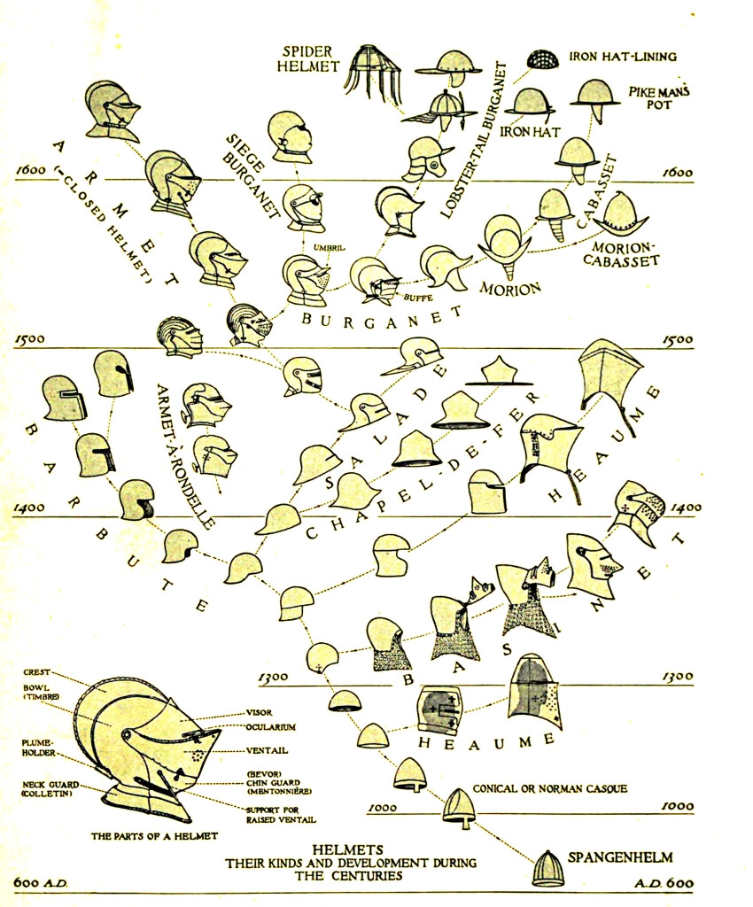

I was reading the wonderful [What Technology Wants](https://en.wikipedia.org/wiki/What_Technology_Wants) by Kevin Kelly (which by the way I strongly suggest to read because open the minds) and I stumbled upon an interesting picture that catches my eyes for a while.

It refers to the evolution of the Medieval helmets over the centuries:

It's a **beautiful** as well as very **informative** infographic that depicts, in a clear way, how the evolution (in this case of an object) follows an organic process suggesting the non-linearity of its journey making its evolution unpredictable by design.

The drawing is by the zoologist [Bashford Dean](https://en.wikipedia.org/wiki/Bashford_Dean) and it has been published around 1920, just to make it in the right perspective.
