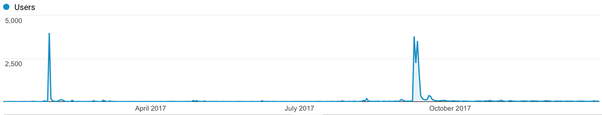
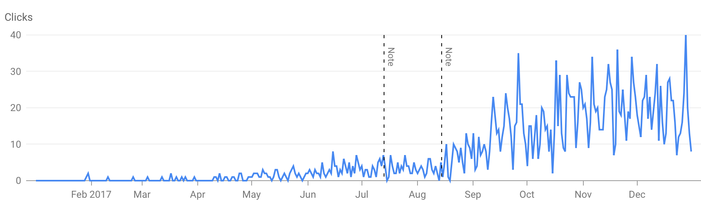

> So, we can buy [followers](https://www.nytimes.com/interactive/2018/01/27/technology/social-media-bots.html) and [web-traffic](https://automattic.design/2018/02/05/paying-my-way-to-success-a-follow-up/) these days, what a great time to live! 

I've started this blog a bit more than a year ago. I did it because I wanted to build something useful for me and for other people plus other reasons you might discover yourself in my [Hello World post](/blog/hello-world/).

## I do track you

I track its usage mainly for **learning purposes**.

Contrary to what many people might believe, I've learned that a massive amount of traffic in a short period of time is not something interesting nor valuable.

This is the full 2017 "audience" report from Google Analytics:

You can easily spot a couple of spikes thanks to **YC** since two of my posts happened to live on its front page for a whole day.

Aside from the momentary happiness of having hundreds of users over my pages, it's quite evident that those spikes didn't contribute to consolidate an 'audience' on my blog. 

I know that it might be a totally different scenario if all my articles were on YC or my contents were about different topics or even the quality of my posts were better or worse but, who knows?  
Indeed, I'm making **assumptions** based on data in a **specific context**. The same in a different context would bring to different conclusions.

The following chart, instead, reveals a different **story**:

It shows the organic traffic brought by Google search engine.

Both charts show two very different situations and the latter speaks about little numbers nevertheless it's the one I do care most because **I'm all about perspectives**.
