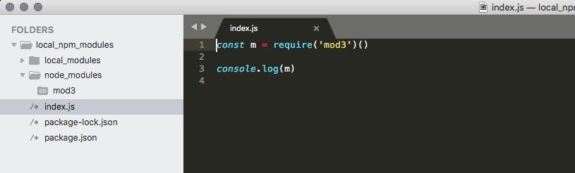

I've just started a personal project, you know, the so-called **side project**, that involves a consistent amount of Node.js code.

For that reason, I've taken the time to investigate a bit on a neat feature of [Npm](https://www.npmjs.com/), the most popular package manager for Node.js ecosystem, to handle **local** modules as they were regular Npm remote and published modules. 

Building a project with a mindset that foster modularity is both a great way to understand the project complexity as well as to fix and refactor it along the way without rewriting everything from scratch over and over. 

Npm is a platform (that comes pre-installed with Node.js) that allows publishing Node.js modules in order to let other people use them, in full open-source spirit. Any developer can then download specific modules with a simple shell command. It allows also to use local modules in a local project, exploiting the good of the modular pattern without publishing them in the public registry.

In order to install a remote module we use this command:

```shell
npm install a_remote_module --save
```

Npm query the registry in order to get the download url, this way a local copy of the module can be put within the project folder (usually in a `node_modules` folder).

We can do the same with local modules as well:

```shell
npm install file:local_modules/mod1 --save
```

where `mod1` is a regular Node module and `local_modules` is a folder within the project root folder.

In case you need to install a local module from another module/project outside the project root, you need to provide the full or relative path towards it.

In this tutorial I'm going to outline the step-by-step to learn how to write and use local modules in a Node.js based project.

## Setting up a Node project with NPM

This is the first step that requires a project folder and an `init` command such as:

```js
npm init
```

Npm will ask for some information in order to compile a basic `package.json` file properly.

Then, let's create a `local_modules` subfolder where we're going to put our local modules.

Each local module needs to be a folder within `local_modules` with a proper `package.json` file. Every time you need a new module, just create it with `npm init`.


Each local module can have its own external `node_modules` as well: 


You can compose a local module using other local modules:


And finally you can use local modules in your project in the same way you'd do with the published one:



Thinking of a project as a collection of independent modules bring a huge benefit in terms of resiliency and maintainability. This is especially useful for long-term projects.

You can check-out the complete files from [this repository](https://github.com/fabiofranchino/exploit-npm-local-modules).