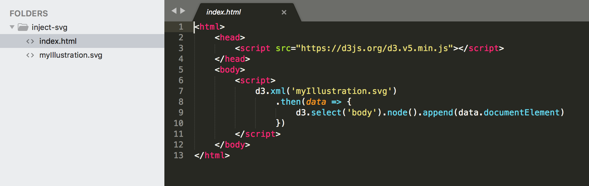

You know, SVG elements can be created and generated by external tools such as **Adobe Illustrator** or **Sketch** (or **Figma**, but this for another post). And that is great.

Maybe you want to work with these files adding some code making them interactive or drawing further graphic elements using code (let's say, data-driven elements).

You already know that you may open the generated SVG file, copy the source code and paste it into your working HTML document. **Not really efficient, uh?**

There's a better way: load the SVG file and inject it into the HTML document at run-time.



This way you can go back and forth between the code editor and the SVG editor very fast, in full iterative and lean spirit.

If you have **jQuery** already loaded in your document, here the code to accomplish this task:

```javascript
$.get('myIllustration.svg', function(data){
    $('body').append(data.documentElement)
})
```

So basically you have to load an external resource, appending the resulting data to the body.

If you want to do the same with **D3.js** (I'm using the version 5 which introduces the promises) without relying with jQuery, here the same functionality:

```javascript
d3.xml('myIllustration.svg')
    .then(data => {
        d3.select('body').node().append(data.documentElement)
    })
```

 or much more cleaner with a mix of pure javascript:

```javascript
d3.xml('myIllustration.svg')
    .then(data => {
        document.body.append(data.documentElement)
    })
```

**Remember:** this is going to work only under a local webserver. Double-clicking the `index.html` file definitely won't work due to browser security concerns. Use [Brackets](http://brackets.io/) to have an all-in-one code editor and local webserver.

