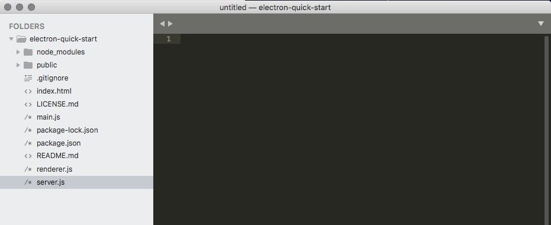
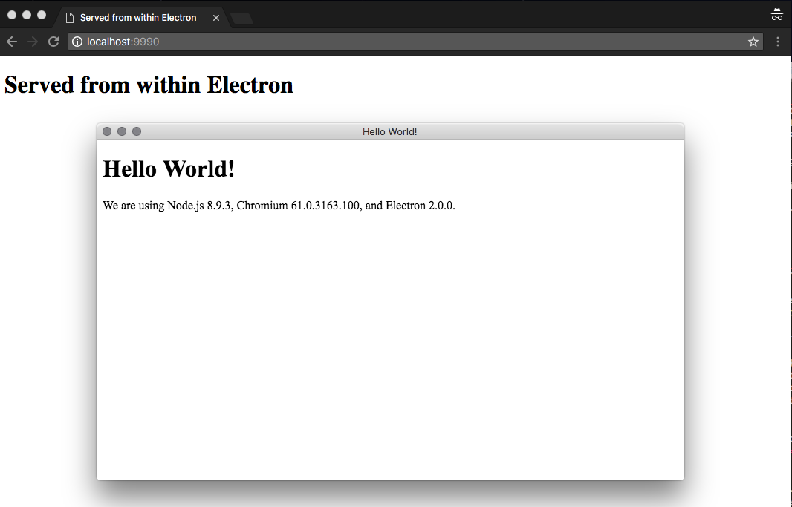

I was poking with this little idea about using [Electron](https://electronjs.org/) as a host to run a local webserver, for a while. So, here the POC, even though I don't know if it's something that can be useful or not but, who knows?

I've cloned the popular [Electron Quick Start](https://github.com/electron/electron-quick-start) to have an Electron app without hassles, then run `npm install` and `npm start` to test whether my Electron instance worked properly.  

I've decided to use `node-static` module as a local webserver which is dead-simple and good enough for this test. I've installed it with `npm i node-static`.

Then, I've created a new `server.js` file in the root folder with the following code:

```javascript
var static = require('node-static');
var file = new static.Server(`${__dirname}/public`)

require('http').createServer(function (request, response) {
    request.addListener('end', function () {
        file.serve(request, response)
    }).resume()
}).listen(9990)
```

This is a very minimal local webserver the serves files in a folder. We also need a folder where to put the files that will be served by `node-static`, the project content should looks like this one: 



The last point was about to run `server.js` from within Electron. The following code does the job and can be put in the `main.js` file or in the `renderer.js` as well, depending of the project scope:

```javascript
const { fork } = require('child_process')
const ps = fork(`${__dirname}/server.js`)
```

I'm exploiting an internal Node.js functionality to run a so-called **child process** to bootstrap the `server.js` script. The `__dirname` variable is required if you want to deploy on a binary build otherwise the script won't be reached properly.

That's approximately all. Now you just need to run the `npm start` command from the shell to run Electron and don't forget to point your browser to the URL `http://localhost:9990`:



Happy hacking.
