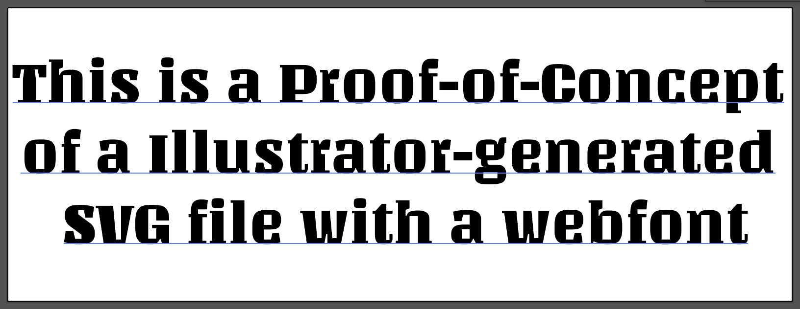

A benefit while working with **SVG** files is that they can be crafted with designer-friendly tools such as Adobe Illustrator / Figma.
The **SVG format is great** at encoding a document structure. It uses several types of objects, from simple to complex shapes to present a visual document. Of course, it can contain texts as well.

## The font problem
Text objects usually can be styled with several properties. One of the most obvious ones is the **font family**.
Adobe Illustrator allows assigning font family by picking the desired one up from the list of fonts installed at the operating system level. 

In SVG, texts are encoded as `text` elements with some attributes that define properties such as `font-family`, for instance.

A possible, and very common, problem is the **missing font** if the composition is open/view from another device that doesn't have that font installed.

## The web-font solution
Nowadays, web-font is the common tech to solve that specific problem on web documents. Let's see how to exploit it in Illustrator-generated SVG documents.

In this example, I'm using the Google Fonts services, but the same strategy can work also with other services as well.
First thing, let's download the font file of choice in order to install on the computer. For instance, I'm going to use the [Unlock](https://fonts.google.com/?selection.family=Unlock) font from the service.

Next, on Illustrator, let's assign the font **Unlock** to the text elements. This is what I see on Illustrator:



By checking the SVG code, this is how Illustrator (with my current settings) encoded the **font-family** information on the text element:

```html
<text><tspan font-family="'Unlock-Regular'" font-size="60px">This is a Proof-of-Concept</tspan></text>
```

Let's move on Codepen, pasting the SVG code on a new pen. 

The document should show the correct font even without importing the web-font from Google.

That's because my computer still has the **Ultra** font installed. Since I want to be sure my document will load and show the correct font on other devices, it's better to disable it from the operating system.

Now it's time to follow the Google instruction importing the web font with this link:

```html
<link href="https://fonts.googleapis.com/css?family=Unlock" rel="stylesheet">
```

and in the CSS:

```css
svg{
  font-family: 'Unlock', cursive;
}
```

If you've followed the instructions you **should NOT** see the expected result.

That's because there's a discrepancy between the `font-face` name and the one encoded in the SVG by Illustrator. The SVG is looking for `Unlock-Regular` but the available one is `Unlock` which is similar but different.

To solve it, we need to fix the discrepancy. The following solution is for Google Fonts service only. Other services might require some adaptations, but the concept is the same:

> Font-Family name in SVG should match with the Font-Face name in CSS

Let's check the content of the Google css source file at `https://fonts.googleapis.com/css?family=Unlock`. You should see something like:

```css
@font-face {
  font-family: 'Unlock';
  font-style: normal;
  ...
}
```

Now, instead of including the Google link, let's just using the source declaration with a tiny modification:

```css
@font-face {
  font-family: 'Unlock-Regular';
  font-style: normal;
  ...
}
```

And here the proof of this technique:

<p data-height="365" data-theme-id="0" data-slug-hash="XorLmr" data-default-tab="result" data-user="abusedmedia" data-pen-title="svg font" class="codepen">See the Pen <a href="https://codepen.io/abusedmedia/pen/XorLmr/">svg font</a> by Fabio Franchino (<a href="https://codepen.io/abusedmedia">@abusedmedia</a>) on <a href="https://codepen.io">CodePen</a>.</p>

## Alternatives?

There are different ways to solve this problem, with pro's and con's as usual.

By converting as path all the text elements does fix the problem at the cost of losing the editable text in the SVG document as well as increasing the size of the file since a text converted as `path` elements requires much more encoding than the `text` element itself.

Another solution is by modifyng the SVG source changing the **font-family value** with the CSS one. This makes it hard maintaining the SVG for further modifications on Illustrator.

Using the web-font technique requires a bit of work but the benefits are worth the efforts.