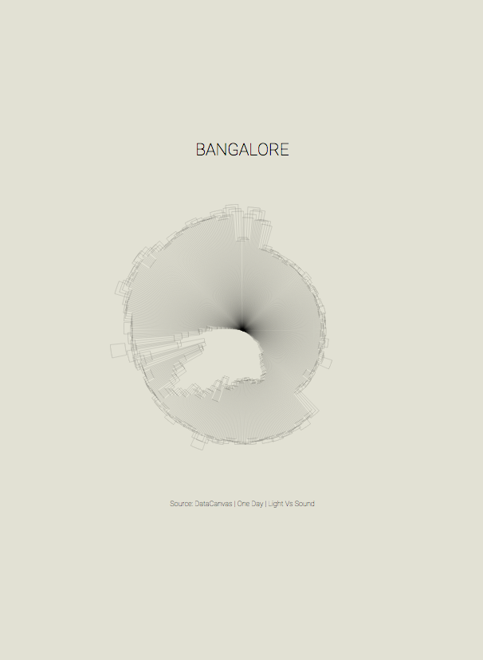
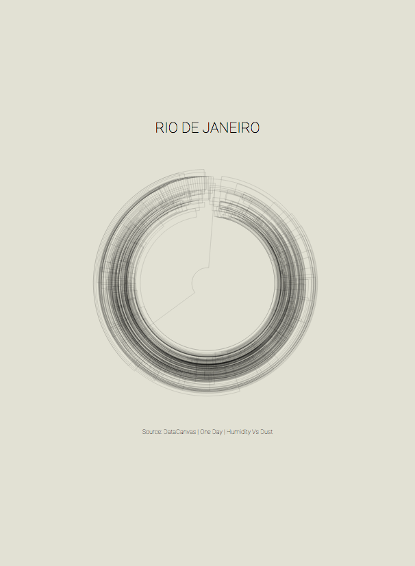
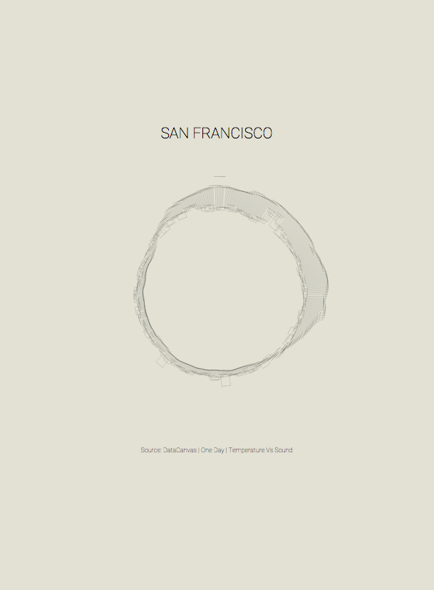
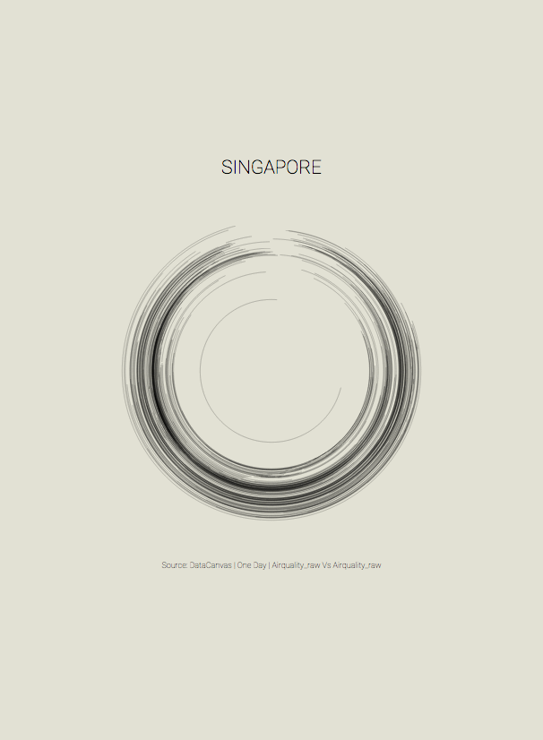

I've resurrected a bunch of images found on my hard-drive. They are related to a teaching experience I had in Shanghai a couple of years ago, a data-visualization workshop for design students at [Tongji University](https://www.tongji.edu.cn/).

I remember that I've used some open data sources from the project [Data Canvas](http://datacanvas.org/sense-your-city/), as by today, they don't seem to be available anymore.

I had prepared some examples with D3.js as a starting point for the sudents to allow them making some visual explorations using data as **raw material**.

Here some screenshots of this little project, visual reperantations using pollution data of specific cities, of which unfortunately I cannot find the source code anymore.

In retrospect, I find them interesting:

