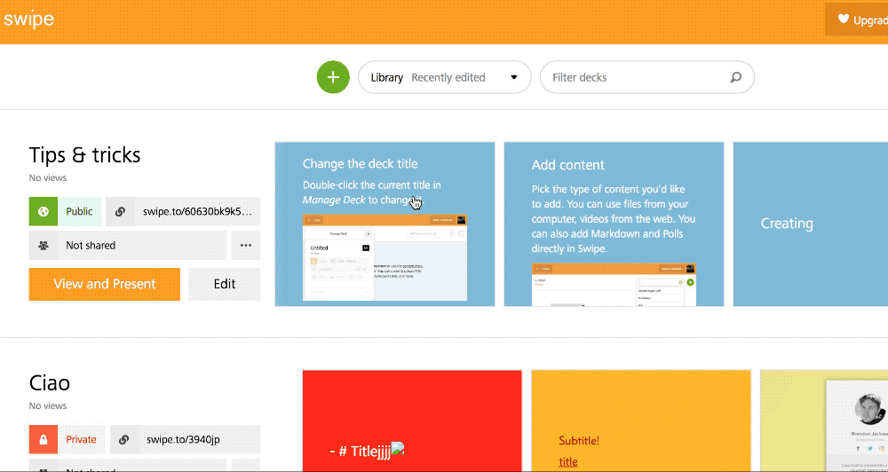
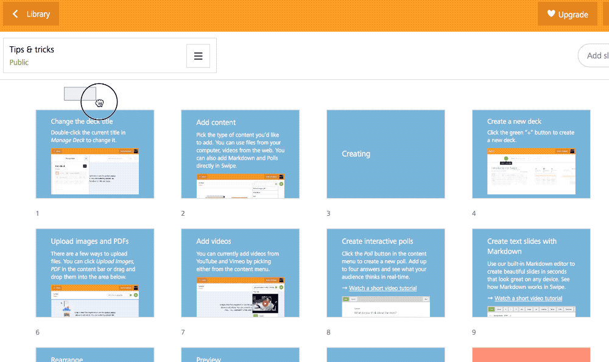
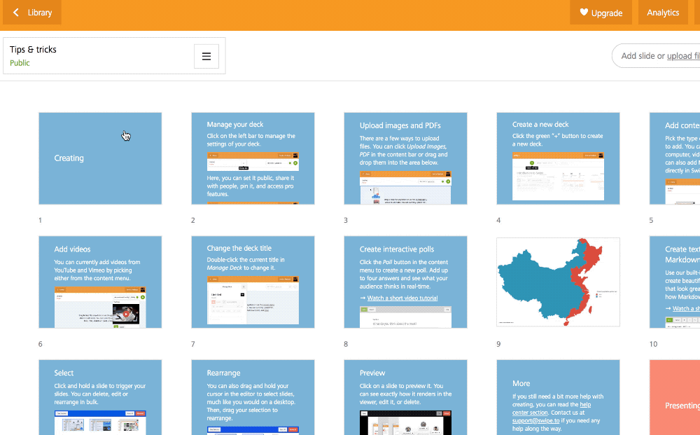
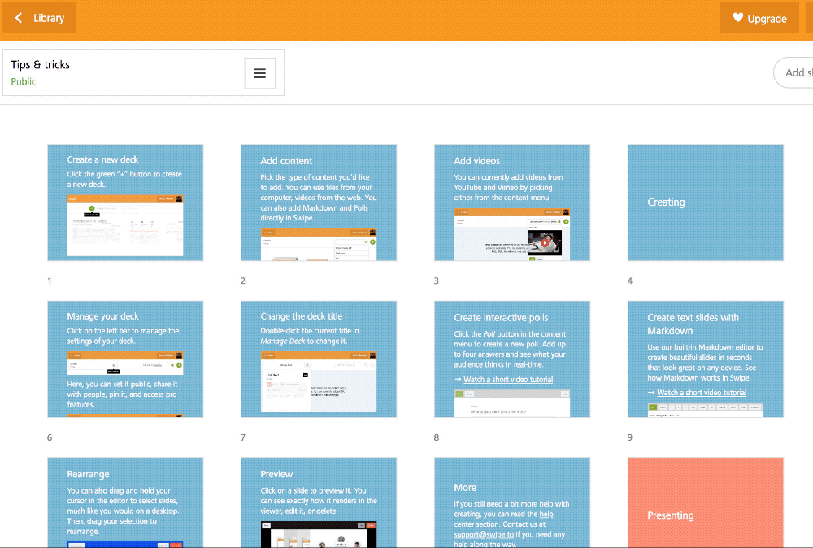
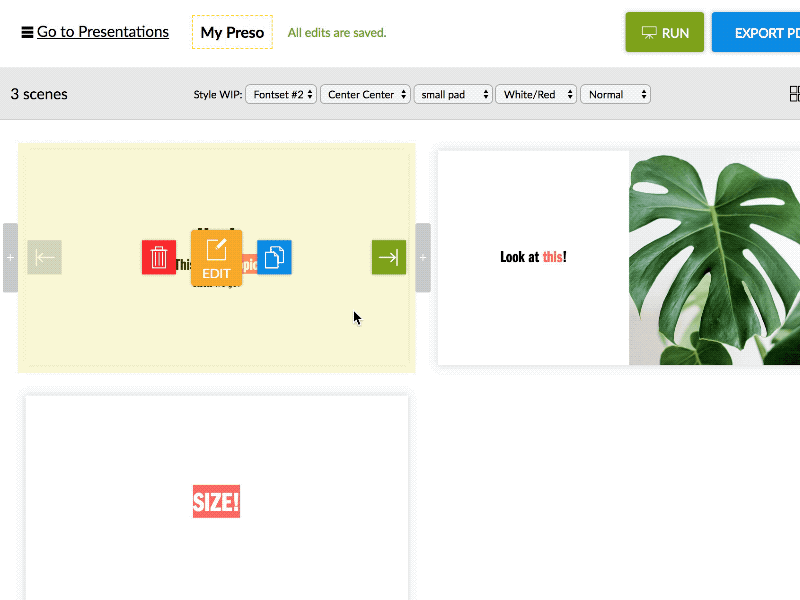

This is the first post of a series related to the [good part](/blog/competitors-are-good/) of having **competitors**. [Presenta](https://www.presenta.cc) is not [alone](/blog/lets-talk-about-presentation-tools/) as you may guess. This post talks about [Swipe](https://www.swipe.to/home). 

**Swipe** is an online presentation tool. It's mostly markdown based with a focus on simple presentations that can be built very quickly. It has limited composition capabilities but it has a rational interface that makes it a good option in the field.

## The index view is done right

The presentation list is very good. It shows clearly some important indicators (public/private and sharing setting) and the most frequently used buttons (View and Present and Edit).

The possibility to scroll all the presentation thumbs horizontally is **sooo good**. You can have a glimpse of the content in a bunch of seconds. Furthermore, you can click to edit a specific slide from there.

## The grid view to edit multiple slides

The other well designed component is the grid editor. Nothing new but it just works.

Selecting one single slide is not very clear, though (I had to read the help to discover how to do that), in general, it allows the typical tasks related to arranging and managing slides in the context of a presentation builder.

## The Drag&Drop

This cannot be avoided. The ability to drag&drop elements is part of any digital experience today. Swipe does it right without fuss.

And the drag images over to create slides on the fly is simply great!

## What about Presenta?

[Presenta](https://www.presenta.cc) has an initial version of a similar capability. Right now, you can select multiple slides by clicking them arbitrarily and a dedicated tool to performe common tasks such as move, delete and duplicated appear on the contextual top bar.

On the way, the same tool will allow drawable selection and drag&drop to arrange slides quickly. The drag&upload is also in the pipeline. Furthermore, a copy/paste function will complete that part of the editor as well.

Want to test it out? Become a beta tester [here](https://www.presenta.cc)!